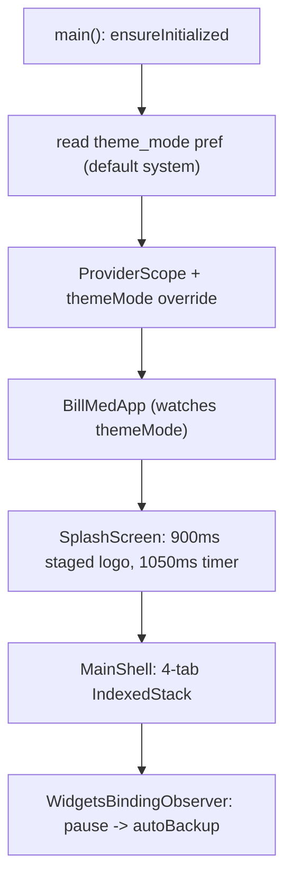
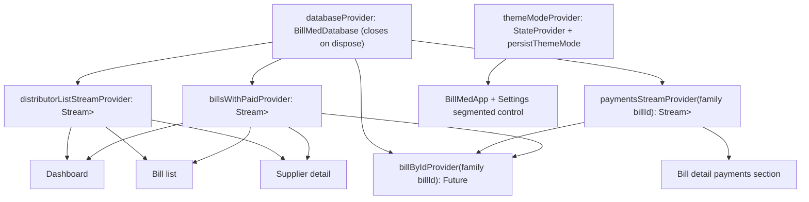
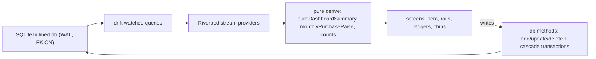
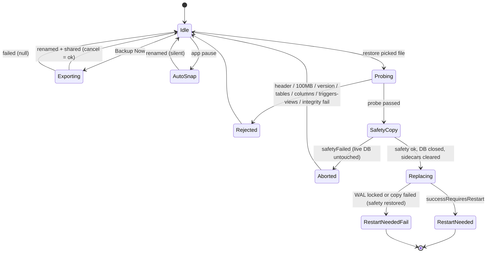
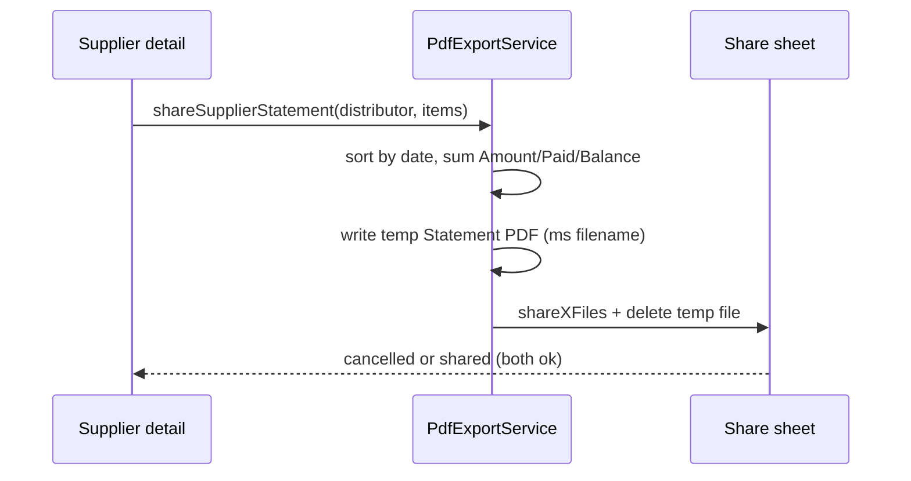
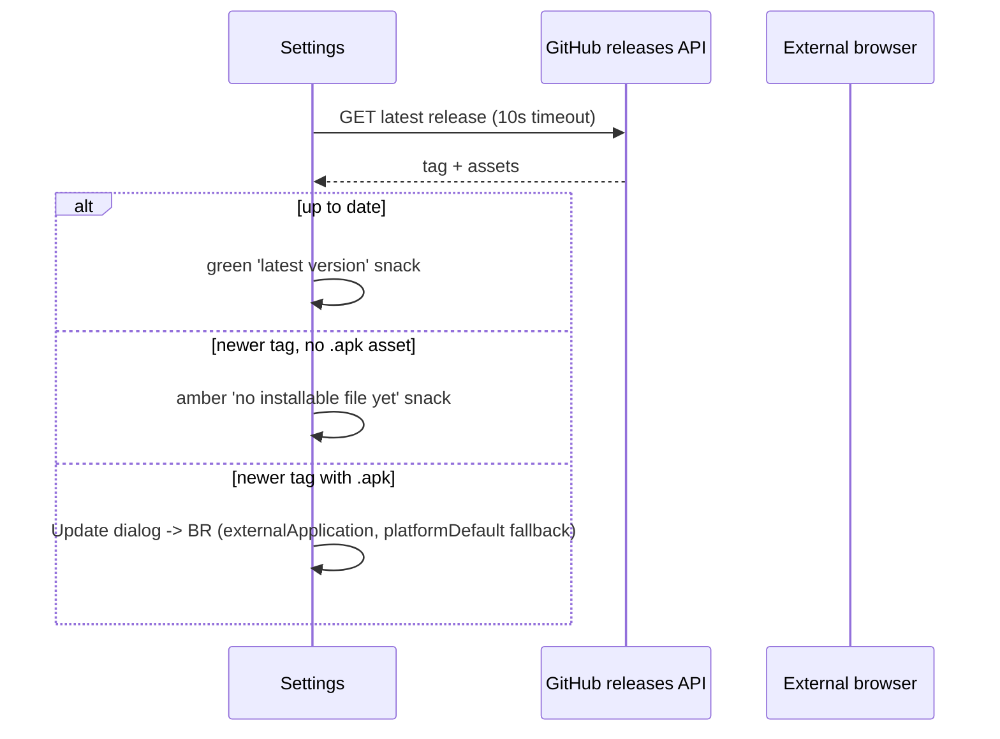

# BillMed Architecture

Offline-first ledger: Flutter UI → Riverpod streams → Drift (SQLite).
One watched bills query is the source of truth; every derived number is a
pure function of it. Verified against `lib/`, `pubspec.yaml`
(`0.1.0+5`), `LICENSE` (MIT 2026 krsnaSuraj),
`android/app/src/main/`, `assets/icon.png` (512×512), and `test/`
(12 files, 95 tests).

Design principles:

- Streams, not invalidation — screens derive from watched queries.
- Integer paise everywhere; one formatter for display.
- Destructive actions confirm first and report failure honestly.
- Backup files are plaintext SQLite; restore never touches live data
  before a probe plus a safety copy succeed.

## Startup

`lib/main.dart` preloads the saved theme (`shared_preferences`,
key `theme_mode`) **before** `runApp`, then injects it as a provider
override so the first frame already uses the right mode. `BillMedApp`
watches `themeModeProvider` and builds `MaterialApp` with
`AppTheme.light` / `AppTheme.dark` over a `SplashScreen` home.



Splash staging (`lib/screens/splash_screen.dart`): one 900 ms controller
drives slip fade + slide (0–44 %), badge elastic scale (39–78 %), and
wordmark fade (67–100 %), with a separate 1600 ms breathing pulse behind
the logo. A 1050 ms timer then replaces the route with `MainShell` via
`AppMotion.pageRoute`.

`MainShell` keeps all four tabs alive in an `IndexedStack` (Dashboard,
Bills, Suppliers, Settings) inside a custom pill bottom bar. Overdue
deep-link: dashboard calls `_openOverdueBills`, which selects the Bills
tab, sets the overdue flag, and bumps `_billsFilterEpoch`; the Bills
screen is keyed `ValueKey('bills-epoch')` and constructed with
`initialOverdueOnly`, so the deep-link always rebuilds fresh. Any manual
tab tap clears a live overdue filter (bumping the epoch only when one
was active) so the tab can never get stuck filtered. Backgrounding the
app fires `BackupService.autoBackup` — fire-and-forget.

## Providers graph

`lib/providers/database_provider.dart` plus
`lib/providers/theme_provider.dart`:



Key contracts:

- `watchAllBillsWithPaid` is a single `LEFT JOIN` aggregate
  (`COALESCE(SUM(amount_paise),0)`) ordered by `bill_date DESC, id DESC`.
  Every screen filters / sorts / sums from this stream — never its own
  query plus manual refresh.
- `billByIdProvider` watches both the payments stream and the bills
  stream for its bill, so edits made elsewhere refresh detail without
  pop / repush. It resolves through `getBillWithPaid`.
- `watchPaymentsByBill` sorts ascending by payment date in Dart.
- `themeModeProvider` is overridden at startup with the persisted value;
  Settings writes through `persistThemeMode`.

## Data flow



- Reads: cold start shows `SkeletonList`; half-loaded pairs are never
  rendered (dashboard and suppliers wait for **both** streams); errors
  surface an error card with Retry that invalidates the providers.
- Writes: `addBill`, `updateBill`, `addPayment`, `updatePayment`,
  `deletePayment`, plus two atomic cascades — `deleteBillCascade`
  (payments then bill, one transaction) and `deleteDistributorCascade`
  (payments via sub-select, then bills, then distributor, one
  transaction). Undo re-inserts inside a transaction too.
- Money math: `BillPaid.remainingPaise` clamps per bill;
  `buildDashboardSummary` nets `amount - paid` across each supplier's
  bills and clamps per supplier, then nets globally and clamps once.
  The dashboard overdue rail (`SUM remaining where overdue`, computed
  in the dashboard body) is always `<=` the all-bills header. Note the
  honest edge: the Bills header sums per-bill clamped remainders while
  the dashboard hero uses the globally netted total, so an overpaid
  bill's credit shrinks the hero but not the Bills sum — both numbers
  are shown where each definition is correct.

## Schema and migrations

Drift schema version **4** (`lib/database/database.dart`,
`lib/database/tables.dart`). Foreign keys enforced at open
(`PRAGMA foreign_keys = ON`), journal mode WAL, synchronous NORMAL.

```text
distributors
  id INTEGER PK AI | name TEXT | company TEXT? | phone TEXT? | created_at
bills
  id INTEGER PK AI | distributor_id FK -> distributors.id
  bill_number TEXT | bill_date | amount_paise INTEGER | notes TEXT? | created_at
  INDEX idx_bills_distributor (distributor_id)
  INDEX idx_bills_bill_date (bill_date)
payments
  id INTEGER PK AI | bill_id FK -> bills.id
  payment_date | amount_paise INTEGER | mode TEXT
  reference_no TEXT? | notes TEXT? | created_at
  INDEX idx_payments_bill (bill_id)
  INDEX idx_payments_payment_date (payment_date)
```

- Table-level `@TableIndex` annotations declare the four indexes;
  `_createIndexes` additionally issues `CREATE INDEX IF NOT EXISTS` so
  the v4 upgrade is idempotent on real v1/v2/v3 databases that already
  carry them.
- `onUpgrade` from below v4: drops legacy `bank_transactions` when
  present, then migrates rupee-real columns to integer paise with
  `CAST(ROUND(amount * 100) AS INTEGER)` on both `bills` and
  `payments`, then creates indexes. Fresh installs use `createAll`.
- Uniqueness of bill numbers is per supplier and case-insensitive
  (`billNumberExistsForDistributor`, optional `excludeBillId` for edits),
  enforced in the form layer plus the delete-Undo rename path — not a
  DB unique index.
- Delete cascades are **application transactions**, not
  `ON DELETE CASCADE`: payments are removed before their parent rows
  inside `db.transaction`.

## Backup and restore state machine

`lib/services/backup_service.dart`. A static `_busy` flag serializes all
runs. Timestamps carry milliseconds (`yyyyMMdd_HHmmssSSS`) so repeats
within one second never collide.



- Export: `VACUUM INTO` a hidden `.tmp.db` (WAL checkpoint + file copy
  fallback), size sanity (`>= 100` bytes), atomic rename to
  `BillMed_backup_<ts>.db`, then `share_plus`. Busy returns null.
- Auto: same dance into the single `BillMed_auto_backup.db` slot.
- Import probe runs on a **private temp copy** via `_ProbeDatabase`
  (`schemaVersion 4`, migrations disabled): rejects over-100 MB files,
  non-`SQLite format 3` headers, `user_version` outside 1–4, missing
  `distributors` / `bills` / `payments`, wrong money column per version
  (`amount` pre-v4 vs `amount_paise` on v4), any trigger / view, and
  non-`ok` `integrity_check`. Extra tables stay allowed (legacy files
  may carry `bank_transactions`; the migrator drops it on reopen).
- Replace: safety copy (`BillMed_pre_restore_<ts>.db`, same-ms safe),
  `db.close()`, delete `-wal` / `-shm` / `-journal` sidecars — an
  undeletable sidecar fails closed (safety copy restored,
  `failedRestartRequired`). Copy over the live path, then the app must
  restart: `PopScope(canPop: false)` dialog with Close App Now
  (`SystemNavigator.pop`; on iOS a swipe-away hint instead, since the
  call is a no-op there).
- Settings mirrors every outcome: confirm sheet before picking, invalid
  / busy / `safetyFailed` snacks, silent cancel, plus the My Backups
  tile (manual files preferred over auto; header + size re-validated
  before every reshare).

## PDF and update sequences

Supplier statements (`lib/services/pdf_export_service.dart`): Roboto
assets when bundled (real `₹`), Helvetica fallback with `Rs.` swap
otherwise. `_money` delegates to `formatPaise` so screen and PDF can
never disagree. Rows sort ascending by date; each row shows
Amount / Paid / Balance (`remainingPaise`); the TOTAL row sums the three
columns, so row TOTAL consistency holds by construction. Files land in
the system temp dir as `Statement_<sanitized>_<yyyyMMdd_HHmm>ms.pdf`
and are deleted after the share sheet resolves (cancel still returns
true — the PDF itself was fine). The detail-screen Share button is
disabled for empty bill lists (`_sharing` guards double tap).



Update checks (`lib/services/update_service.dart`) are **manual only** —
no polling, no background fetch. Settings calls `manualCheck`, which
hits the GitHub latest-release API over HTTPS with a 10 s timeout,
strips a leading `v`, compares semver cores then build numbers, and:



Offline or malformed responses show the red connectivity snack. The
dialog deep-links the releases page in an external browser; the app
never downloads or installs anything itself.

## Bills UI contract

Bill list (`lib/screens/bills/bill_list_screen.dart`) — no `AppBar`; a
full-cover `MeshHeader` sits behind a live subtitle that reads
`Loading bills…` on cold start (never a fake `0 bills` flash), then
`N bills · ₹X pending` summed over all bills. Search (bill number or
supplier, 250 ms debounce, instant clear) feeds 5 chips — All, Unpaid,
Partial, Paid, Overdue — whose counts are scoped to the
search + supplier subset. The supplier pill filters via action sheet;
the sort pill offers Newest / Oldest / Amount high-to-low; a Reset pill
appears only when supplier or sort diverge and restores everything.
Date orders render month-group headers; amount order is a flat global
list with newest-id tiebreak. Each row: supplier `·` date line, amount
in danger red while owed (calm text once settled, red dot when
overdue), `StatusChip`, plus a `Due ₹X` line on partial rows and an
`Advance ₹X` line on overpaid rows. Swipe-to-delete captures payments
first (abort + snack when unreadable), confirms with the payment count,
re-captures after confirm (a payment added under the sheet dies in the
cascade too), deletes, and offers Undo that re-inserts bill + payments
in one transaction with original ids preserved — renaming to
`<number> (restored)` on a number clash and a failure snack when restore
is impossible. Stream errors show an error card with Retry.

Bill detail (`lib/screens/bills/bill_detail_screen.dart`) — `SliverAppBar`
(expanded 200, pinned) over a status-tinted gradient with sheen and
frost strip: bill number, hero amount (shared `billamt-<id>` tag with
the list), `StatusChip` in `onGradient` frost mode, one-line
`Paid ₹X · Due ₹Y`, an Advance line when overpaid, and an overdue strip
quoting the 30-day rule. Body: meta rows (number, date, supplier,
notes), payments section with skeleton while uncached and error card +
Retry on failure, vertical timeline rows (mode icon disc + connector,
amount, date `·` reference, mode pill, per-payment edit / delete menu),
`Settled` pill for settled bills, and a Record Payment FAB only while
unsettled. A bill deleted elsewhere renders a ghost card
(`This bill no longer exists.`); payment delete offers Undo that
re-inserts the payment and says so when it cannot.

Add / edit bill (`lib/screens/bills/add_bill_screen.dart`) — supplier
via searchable bottom sheet (empty-store guidance included), duplicate
bill-number guard per supplier (edit excludes self), bill-date picker
clamped to today (future dates impossible; post-today initials snap
back), paise-safe amount field, dirty tracking with discard confirm,
and a save-in-flight back guard: `PopScope` swallows back presses while
saving instead of stacking a discard sheet that would double-pop.

Add / edit payment (`lib/screens/payments/add_payment_screen.dart`) —
five `PaymentMode` chips (Cash, UPI, Cheque, NEFT, RTGS) with per-mode
reference hints (UTR for NEFT/RTGS), outstanding strip, Pay Full chip
(create flow with positive balance), payment-date clamped to today and
rejected before the bill date, and one shared overpay guard for create
**and** edit: any amount above outstanding names the excess
(`Amount exceeds outstanding by ₹X. Record anyway?`) behind a danger
confirm. Same dirty + save-in-flight back-guard protocol as the bill
form.

Suppliers (`lib/screens/distributors/`) — list ledger with phone-digit
search (non-digits stripped both sides) and a filtered dues header
(`N of M suppliers · ₹X dues` while searching, so a filtered count is
never paired with the global total). Detail is a 230 px sliver with
live distributor row (edits elsewhere reflect without repush), ghost
card when deleted elsewhere (`This supplier no longer exists.`),
`FittedBox`-scaled pending amount, `company · phone · tap to call`
line, Billed / Paid / Pending glass tiles, share wiring with
empty-list guard, and date-DESC + id-DESC ledger rows with live
`Paid X of Y` + overdue suffix lines. Dialing normalizes: 10 digits →
`+91`, leading-`0` 11 digits → `+91` rest, longer digit strings → `+`
prefix, all via a `tel:` intent.

Settings (`lib/screens/settings/settings_screen.dart`) — theme
`SegmentedButton` (Light / Dark / System, persisted), transfer guide
dialog (6 steps, explicit NOT-encrypted file warning, Backup Now
shortcut), Backup Now tile with busy label, My Backups tile with newest
label + validated reshare, restore tile with confirm + restart dialogs
(iOS swipe hint, busy / `safetyFailed` snacks), update-check tile
(spinner while checking), and a brand profile hero with version pill
(`PackageInfo` `version+build`).

## Theme, motion, and widget contracts

`lib/theme/app_theme.dart` — indigo `0xFF1A237E` / teal `0xFF00BFA5`
brand; `AppGradients.brand` (indigo → teal, stops 0 / 0.52 / 1) plus
sheen and success / danger / warning soft gradients; `AppRadius`
12 / 16 / 20 / 28 / pill; light `#F0F2F8` and dark `#0D0D1A`
backgrounds with brightness-aware text / subtitle / card helpers;
`AppShadow.hero` (light-only glow) and dark-mode card borders;
`AppHaptics` vocabulary (select / confirm / destroy).

`AppMotion` — `fast` 150 ms, `medium` 250 ms, `page` 300 ms,
`staggerStep` 60 ms; `entrance` easeOutCubic and `emphasized`
cubic(0.05, 0.7, 0.1, 1.0); `pageRoute` fade + slight slide;
`fadeSlideIn` stagger capped at index 8.

| Widget (`lib/widgets/`) | Contract |
| ----------------------- | -------- |
| `MeshHeader` | Aurora blobs; bottom edge melts via `ShaderMask` dstIn (stops 0 / 0.62 / 1). Heights: dashboard 300, bills 260, suppliers 230, detail 230, forms 180–200. |
| `GlassBar` | Frost strip (`BackdropFilter` blur 18, theme tint) under collapsing bars. |
| `DrawSparkline` | 900 ms left-to-right draw-in + fade over `MiniSparkline`; replays on value change; fade-only when width is unbounded; hides for < 2 points or all-zero. |
| `TiltOnScroll` | Scroll-offset perspective tilt (max 0.04) wrapping the dashboard hero. |
| `PressScale` | 1.0 → 0.97 over 120 ms; accessibility label; optional divider under row; `index` adds the staggered entrance. |
| `showActionSheet` / `confirmSheet` | Bottom menus / danger confirms; single-open guards; scrollable content. |
| `showAppSnack` | Queued floating snacks: green 4 s success, red 6 s failure, optional action (Undo). |
| `AnimatedMoney` | 400 ms `IntTween` between paise values through `formatPaise`. |
| `StatusChip` | Danger / warning / success / info pill; `onGradient` switches to white-on-frost for gradient headers. |
| `SectionHeader` | Title + optional count pill. |
| `BrandLogo` | Squircle + bill-slip + badge + cross; fractions mirror the launcher foreground 1:1, so splash and icon match. |

Launcher set: adaptive icon (gradient background drawable, foreground,
monochrome) plus legacy `mipmap-*` dirs; `assets/icon.png` is the
512×512 store source.

## Module map

```text
lib/main.dart                        prefs preload, scope, MaterialApp
lib/database/                        tables, BillMedDatabase (v4), BillPaid
lib/models/                          bill_status (status + overdueDays=30),
                                     enums (5 payment modes)
lib/providers/                       database + 4 watched providers, theme
lib/services/
  summary_service.dart               buildDashboardSummary (per-supplier netting)
  backup_service.dart                export / auto / import + probe + safety
  pdf_export_service.dart            statement generate + share (temp file)
  update_service.dart                manualCheck vs GitHub releases
lib/screens/splash_screen.dart       staged logo, shell, epoch link, pause backup
lib/screens/dashboard/               hero 300, sparkline, rail, paid row, ledger
lib/screens/bills/                   list, detail sliver, add/edit bill
lib/screens/payments/                add/edit payment, 5 modes, overpay guard
lib/screens/distributors/            list + detail sliver + call + share
lib/screens/settings/                theme, transfer guide, backup tiles,
                                     restore flow, update check, version
lib/theme/app_theme.dart             colors, gradients, radius, motion, shadow
lib/widgets/                         mesh, glass, sparkline x2, sheets, chips,
                                     animated money, brand mark, press, sections
lib/utils/                           money (formatPaise + parser), text helpers
android/app/src/main/                INTERNET-only manifest, backup rules,
                                     adaptive + legacy icons
test/ (12 files, 95 tests)           memory DB, bounded pumps, pure-function
                                     coverage; picker/share/path untestable
```
