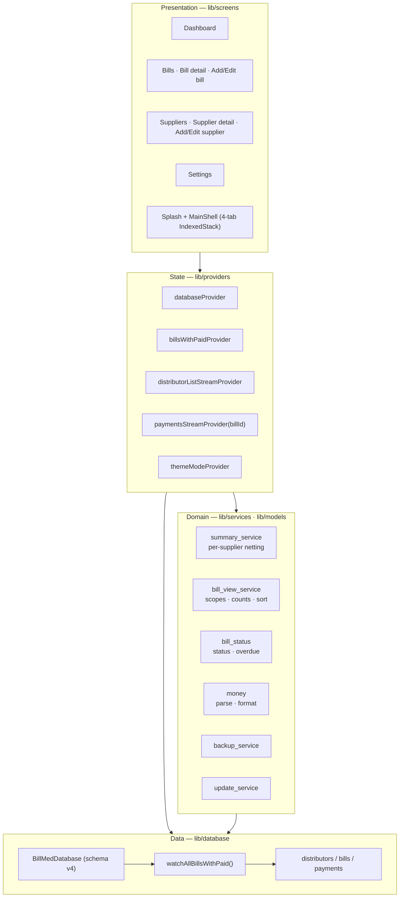
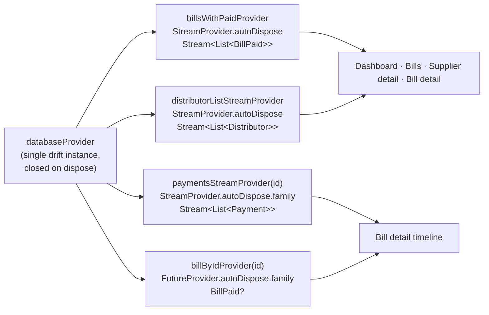
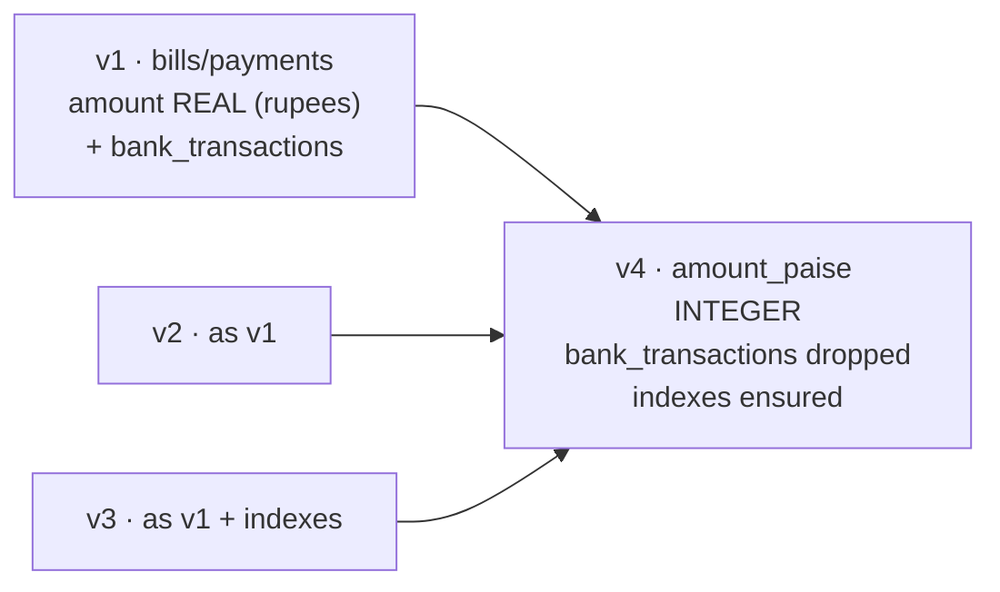
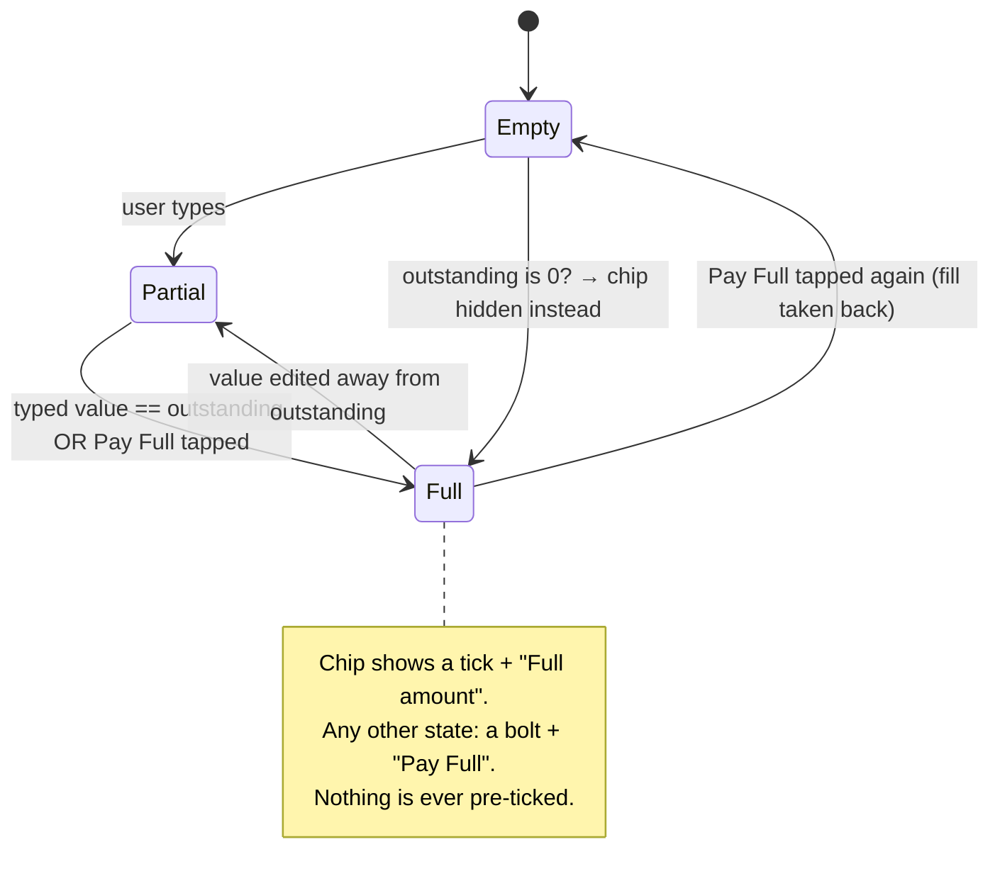
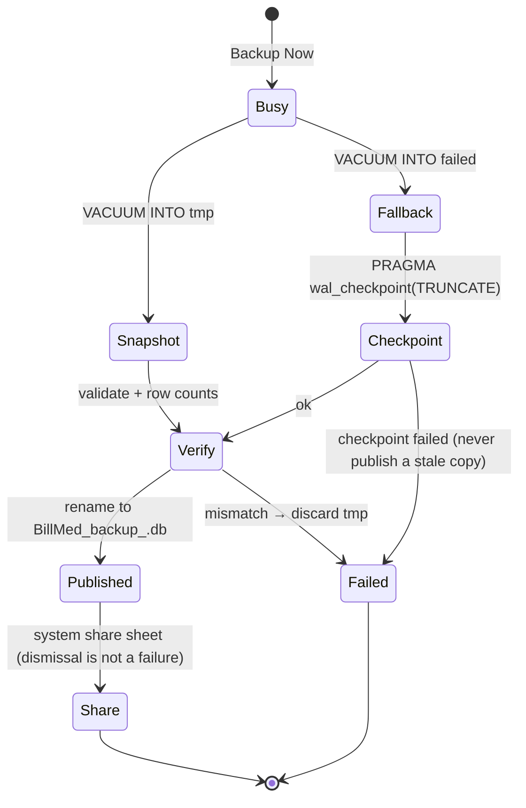
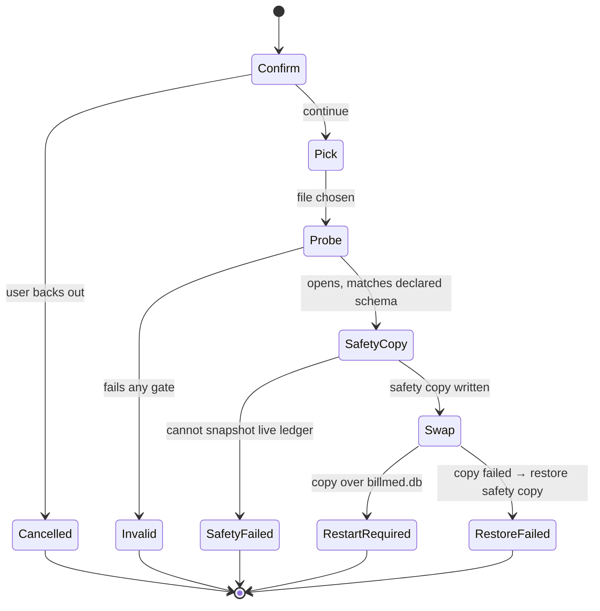
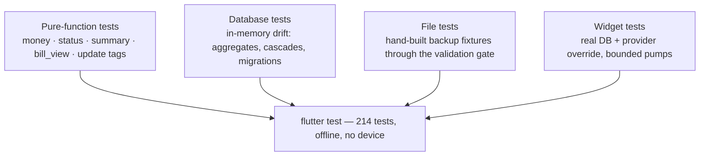

# BillMed Architecture

How the ledger is put together, what is guaranteed, and which test holds each
guarantee in place. Verified against `lib/` (41 Dart files), `pubspec.yaml`
(`0.1.1+7`), `android/`, and `test/`.

---

## Table of contents

- [Design principles](#design-principles)
- [Invariants](#invariants)
- [Layers and data flow](#layers-and-data-flow)
- [Providers](#providers)
- [Data layer](#data-layer)
- [Money representation](#money-representation)
- [Derived state](#derived-state)
- [Screen contracts](#screen-contracts)
- [Widgets, theme and motion](#widgets-theme-and-motion)
- [Backup and restore](#backup-and-restore)
- [Security posture](#security-posture)
- [Failure modes](#failure-modes)
- [Testing strategy](#testing-strategy)
- [Module map](#module-map)
- [Decisions and trade-offs](#decisions-and-trade-offs)

---

## Design principles

1. **Streams, not invalidation.** Screens derive from watched queries. Nothing
   is cached, so nothing can go stale, and no screen has to remember to refresh
   anything else.
2. **One number, one source.** Every figure on screen is a pure function of the
   watched data — including the tiles, the headline total and the statement-like
   rows that explain them.
3. **Integer paise everywhere.** `double` exists only in the input parser and the
   display formatter.
4. **Derived, never stored.** Status, remaining, overdue and balances are
   computed on read. The only stored facts are bills and payments.
5. **Fail closed, and say so.** Destructive or irreversible paths (restore,
   delete, overpay) verify first, confirm explicitly, and report failure honestly
   instead of silently degrading.
6. **Tests pin behaviour, not implementation.** Assertions name user-visible
   guarantees (a number, a label, a row) rather than internal call patterns.

---

## Invariants

These are the promises the app makes. Each one is enforced in code and pinned by
at least one test; the test column names where.

| # | Invariant | Where enforced | Pinned by |
|---|---|---|---|
| I1 | Every stored money value is an integer number of paise | `database/tables.dart`, `utils/money.dart` | `money_test`, `database_test` |
| I2 | A comma is only ever digit grouping; anything else is invalid input | `utils/money.dart` `_isValidGrouping` | `money_test`, `edge_cases_test` |
| I3 | Bill status is a pure function of `(amountPaise, paidPaise)`; a zero-amount bill is settled | `models/bill_status.dart` | `bill_status_test` |
| I4 | Overdue = unsettled **and** strictly more than 30 days old | `models/bill_status.dart` | `bill_status_test`, `supplier_detail_test` |
| I5 | `remainingPaise` never goes below zero | `database/database.dart` `BillPaid` | `bill_status_test`, `edge_cases_test` |
| I6 | A bill with no payments still appears in the watched bill list | `LEFT JOIN` in `watchAllBillsWithPaid` | `database_test`, `widget_flows_test` |
| I7 | Supplier dues net across that supplier's bills, then clamp at zero — never across suppliers | `summary_service.dart` | `summary_service_test` |
| I8 | The dashboard headline equals the sum of the per-supplier dues rows | `summary_service.dart` | `summary_service_test`, `dashboard_money_test` |
| I9 | A supplier is only `Clear` when every bill is settled **and** net dues are zero | `DistributorBalance.fullySettled` | `summary_service_test`, `supplier_detail_test` |
| I10 | The `Paid` scope sums to the `Paid` tile; the `Pending` scope carries the clamped dues | `bill_view_service.dart` | `bill_view_service_test`, `supplier_detail_test` |
| I11 | Bill numbers are unique per supplier, case-insensitively, and an edit excludes itself | `database.dart`, `add_bill_screen.dart` | `database_test`, `bill_ops_test` |
| I12 | A payment can never be dated before its bill, and an existing one is never locked out of editing | `add_payment_screen.dart` | `payment_guards_test` |
| I13 | Amounts above the outstanding balance are always confirmed first | `add_payment_screen.dart` | `payment_guards_test` |
| I14 | Deleting a bill or supplier cascades to its payments in one transaction | `database.dart` | `database_test`, `bill_ops_test` |
| I15 | Undo restores the exact row (amount, mode, reference, notes, date) | `bill_list_screen.dart`, `bill_detail_screen.dart` | `bill_ops_test` |
| I16 | A file may replace the ledger only if it opens, matches its declared schema, and passes integrity + money bounds | `backup_service.dart` | `backup_probe_test` |
| I17 | A backup is published only after it validates and matches the live row counts | `backup_service.dart` | `backup_probe_test` |
| I18 | No safety copy ⇒ no restore | `backup_service.dart` | (reviewed; device-only path) |
| I19 | A supplier name is never cut off: it wraps, then scrolls | `widgets/wrap_or_scroll_text.dart` | `long_name_test` |
| I20 | Hidden tabs do not animate (battery) | `splash_screen.dart` `TickerMode` | (reviewed) |

---

## Layers and data flow



The presentation layer never touches SQL and never computes money on its own; it
renders what the pure services derive from the watched streams.

---

## Providers



Notes:

- `billByIdProvider` watches both the payments stream and the bill list stream
  before reading, so a bill detail page can never show a cached total.
- `autoDispose` keeps memory flat while navigating; the database itself is owned
  by `databaseProvider` and closed when the scope is disposed.
- Screens call `ref.invalidate(...)` only for the explicit **Retry** affordance
  shown when a stream reports an error.

---

## Data layer

### Schema (v4)

```sql
CREATE TABLE distributors (
  id INTEGER PRIMARY KEY AUTOINCREMENT,
  name TEXT NOT NULL,
  company TEXT,
  phone TEXT,
  created_at INTEGER NOT NULL          -- seconds since epoch
);

CREATE TABLE bills (
  id INTEGER PRIMARY KEY AUTOINCREMENT,
  distributor_id INTEGER NOT NULL REFERENCES distributors(id),
  bill_number TEXT NOT NULL,           -- unique per supplier, case-insensitive
  bill_date INTEGER NOT NULL,
  amount_paise INTEGER NOT NULL,       -- integer paise
  notes TEXT,
  created_at INTEGER NOT NULL
);

CREATE TABLE payments (
  id INTEGER PRIMARY KEY AUTOINCREMENT,
  bill_id INTEGER NOT NULL REFERENCES bills(id),
  payment_date INTEGER NOT NULL,
  amount_paise INTEGER NOT NULL,
  mode TEXT NOT NULL,                  -- Cash | UPI | Cheque | NEFT | RTGS
  reference_no TEXT,
  notes TEXT,
  created_at INTEGER NOT NULL
);

CREATE INDEX idx_bills_distributor     ON bills (distributor_id);
CREATE INDEX idx_bills_bill_date       ON bills (bill_date);
CREATE INDEX idx_payments_bill         ON payments (bill_id);
CREATE INDEX idx_payments_payment_date ON payments (payment_date);
```

Connection pragmas (`beforeOpen`): `foreign_keys = ON`, `journal_mode = WAL`,
`synchronous = NORMAL`.

### The aggregate query

```sql
SELECT b.id, b.distributor_id, b.bill_number, b.bill_date, b.amount_paise,
       b.notes, b.created_at, COALESCE(p.total_paid, 0) AS paid_total
FROM bills b
LEFT JOIN (SELECT bill_id, SUM(amount_paise) AS total_paid
           FROM payments GROUP BY bill_id) p
  ON p.bill_id = b.id
ORDER BY b.bill_date DESC, b.id DESC
```

`LEFT JOIN` + `COALESCE` are what make I6 hold: an unpaid bill is a row with
`paid_total = 0`, not an absence. `readsFrom: {bills, payments}` is what makes
the stream live — a write to either table re-emits the whole list.

### Migrations



`onUpgrade` runs only for `from < 4` (drift calls `onCreate` for a fresh file):

1. drop `bank_transactions` if it exists,
2. `alterTable(TableMigration(...))` on `bills` and `payments` with
   `amount_paise = CAST(ROUND(amount * 100) AS INTEGER)`,
3. create the four indexes idempotently (`CREATE INDEX IF NOT EXISTS`), so a
   real v1–v3 file that already carries them does not abort the upgrade.

Because the migration's `INSERT … SELECT` names **every** v4 column, a file that
claims an older version but lacks one of those columns fails the migration on
every later open. That is exactly the failure mode the restore gate now prevents
by validating the full column set before a file may replace the ledger
(see [Backup and restore](#backup-and-restore)).

---

## Money representation

| Concern | Rule | Code |
|---|---|---|
| Storage | `INTEGER` paise | `tables.dart` |
| Parsing | `^(\d{1,11})(\.\d{1,2})?$` after validating grouping | `money.dart` |
| Grouping | Indian `12,34,567` and Western `1,234,567`; last group of 3, middle groups of 2 or 3 | `money.dart` `_isValidGrouping` |
| Invalid input | returns `0`, and `isValidRupeesInput` makes the form show `Enter a valid amount` | `money.dart` |
| Rounding | `(value * 100).round()` — 2-decimal inputs are exact in binary64 for the supported range | `money.dart` |
| Upper bound | 11 digits (₹99,99,99,99,999 ≈ 10¹³ paise) per row | `money.dart` |
| Display | `NumberFormat.currency(locale: 'en_IN', symbol: ₹)`, decimals only when paise ≠ 0 | `money.dart` |
| Editing | `paiseToEditableString` (the exact inverse of the parser) | `money.dart` |

Restore adds a second fence: a file whose rows exceed ₹100 crore (or are
negative) is refused, because such rows cannot come from this app and a column
full of them would overflow SQLite's `SUM()`.

---

## Derived state

```text
computeBillStatus(amount, paid):
    amount <= 0        → Paid          (zero-amount rows settle)
    paid   <= 0        → Unpaid
    paid   <  amount   → Partial
    paid   == amount   → Paid
    paid   >  amount   → Overpaid

remainingPaise = max(amount − paid, 0)

isBillOverdue(billDate, amount, paid, now):
    days(billDate → today) > 30  AND  status(bill) is not settled

DistributorBalance:
    billed   = Σ amount                over that supplier's bills
    paid     = Σ paid
    rawNet   = Σ (amount − paid)
    pending  = max(rawNet, 0)          ← netted per supplier, then clamped
    settledCount  = count(status ∈ {Paid, Overpaid})
    unsettledCount = billCount − settledCount
    fullySettled   = pending == 0 AND unsettledCount == 0

DashboardSummary:
    totalPending = Σ balances.pending  ← identical to the rows on screen
```

`fullySettled` exists because netting creates a counter-intuitive state: one
supplier can hold enough advance on one bill to cancel the dues on another, and
the net is zero while a bill is still unpaid. Showing `Clear` there would be a
lie, so the tile and the row fall back to the (possibly ₹0) net amount and the
`Pending (n)` chip stays non-zero.

Supplier bill scopes (`bill_view_service.dart`) are the third view of the same
data:

| Scope | Matches | Meaning |
|---|---|---|
| `all` | everything | the Billed tile |
| `pending` | `!status.isSettled` | the Pending tile |
| `paid` | `paidPaise > 0` | the bills whose `Paid` lines sum to the Paid tile |
| `overdue` | `isOverdue` | the overdue slice of `pending` |

Counts are always computed on the **full** list, so a chip keeps telling the
truth while a filter is active.

---

## Screen contracts

### Splash and shell

Staged logo animation, then `MainShell`: a four-tab `IndexedStack` where each tab
is wrapped in `TickerMode(enabled: i == _currentIndex)` so a hidden tab cannot
keep animating. Lifecycle `paused` fires the silent auto-backup.

### Dashboard

Headline pending total, last-6-months purchase hero with a draw-in sparkline
(one clock read feeds both the bars and the month labels), overdue rail that
sums the **clamped** remaining of overdue bills and deep-links into the Bills tab
with the overdue chip pre-selected, total-paid row, and the per-supplier dues
ledger. Each row: colour rail (danger / warning / success by state), name (wraps,
then scrolls), company or phone, `n bills · n overdue`, and the dues amount or
`Clear`. A row is only `Clear` when `fullySettled`.

### Bills

No app bar; a live subtitle (`N bills · ₹X pending`), 250 ms debounced search on
bill number or supplier, five chips with counts scoped to the search + supplier
subset, supplier pill, sort pill (newest / oldest / amount), Reset pill, month
group headers for date orders and a flat list for amount order. Swipe-to-delete
captures payments first (aborting if unreadable), confirms with the count,
re-captures after the confirm, deletes, and offers Undo that re-inserts bill +
payments in one transaction with original ids (renaming to `<number> (restored)`
on a clash). A supplier filter pointing at a deleted supplier is dropped
automatically instead of leaving a silently empty list.

### Bill detail

Collapsing status-tinted header (bill number, hero amount, `StatusChip`, one-line
`Paid ₹X · Due ₹Y`, Advance line, overdue strip), meta rows, payment timeline with
per-payment edit / delete + Undo, and a Record Payment FAB while unsettled.
Ghost card when the bill disappeared elsewhere.

### Add / edit bill

Supplier picker sheet, per-supplier duplicate-number guard (case-insensitive,
self excluded when editing), bill date clamped to today, paise-safe amount field,
dirty tracking with a discard confirm, and a save-in-flight back guard.

### Add / edit payment

Five mode chips with per-mode reference hints, outstanding strip, **Pay Full**
chip, date guard (create only), shared overpay guard for create and edit, and the
same dirty + save-in-flight protocol.



### Suppliers

Ledger with phone-digit search (non-digits stripped on both sides) and a
filtered dues header (`N of M suppliers · ₹X dues`, so a filtered count is never
paired with the global total). Detail: collapsing header with the live
distributor row, `FittedBox`-scaled pending amount, tap-to-call, the three tiles
(which are also the filters), scope chips with counts, and the bill ledger where
each row reads `#number` + status chip, `date · Billed ₹X`, `Paid ₹Y · Due ₹Z`
(`· Advance ₹V` when overpaid, `· Overdue` past 30 days). A filtered-to-nothing
ledger names its own scope and offers `Show all bills`.

### Settings

Theme (Light / Dark / System, persisted), transfer guide, Backup Now (with the
plaintext warning on the tile itself), My Backups (manual → before-restore →
auto, re-shared only after passing the same validation the restore uses), Restore
(confirm, then the state machine below), and the manual update check.

---

## Widgets, theme and motion

| Widget | Contract |
|---|---|
| `MeshHeader` | Aurora blobs painted behind each screen; bottom edge melts via a `ShaderMask` |
| `GlassBar` | Frost strip under collapsing bars |
| `DrawSparkline` / `MiniSparkline` | 900 ms draw-in; replays when values change |
| `TiltOnScroll` | Scroll-linked perspective tilt on the dashboard hero |
| `PressScale` | 1.0 → 0.97 press feedback, accessibility label, optional divider, staggered entrance |
| `AnimatedMoney` | 400 ms integer tween through `formatPaise`; a single tick listener for the widget's whole life |
| `StatusChip` | Danger / warning / success / info pill, `onGradient` variant for headers |
| `WrapOrScrollText` | Fits → wraps; does not fit → scrolls its own line; animations disabled → static. No `LayoutBuilder` (it cannot answer intrinsic queries inside `IntrinsicHeight`) |
| `showActionSheet` / `confirmSheet` / `showAppSnack` | Bottom menus, danger confirms and queued floating snacks with Undo |

Tokens (`theme/app_theme.dart`): brand indigo `#1A237E` → teal `#00BFA5`;
radius 12 / 16 / 20 / 28 / pill; motion 150 / 250 / 300 ms with a 60 ms stagger;
one haptic vocabulary (select / confirm / destroy).

Two layout rules are load-bearing and easy to break:

1. A stretched `Row` inside a sliver box demands an infinite height — the tiles
   strip is wrapped in `IntrinsicHeight` so the row gets a finite height first.
   Without it, the tiles painted while everything below them (the whole bill
   ledger) was pushed out of the paint extent.
2. `IntrinsicHeight` asks its children for intrinsic dimensions, so nothing
   inside such a row may be a `LayoutBuilder`. `WrapOrScrollText` measures after
   layout through its render objects instead.

---

## Backup and restore

### Export (manual)



Auto-backup (on app pause) follows the same path into
`BillMed_auto_backup.db`, silently and best-effort.

### Restore



### The validation gate

`BackupService.validateBackupFile(path)` is the single entry point; restore and
the My Backups re-share both go through it. In order:

| Gate | Rejects |
|---|---|
| size | `< 100 B` (torn/empty) or `> 100 MB` |
| header | anything whose first 15 bytes are not `SQLite format 3` |
| `user_version` | anything outside 1–4 |
| tables | a file missing `distributors`, `bills` or `payments` |
| columns | a file whose declared version cannot supply **every** column the app reads (v4: `amount_paise`; v1–v3: legacy `amount`) — this is the gate that prevents a crafted legacy file from bricking the next launch |
| foreign objects | any `trigger` or `view` (BillMed creates none) |
| money bounds | negative values, or values beyond ₹100 crore per row |
| integrity | `PRAGMA integrity_check != 'ok'` |

Restore then:

1. copies the picked file into a private cache probe (never opens the user's file
   in place — that would create `-wal`/`-shm` sidecars next to it),
2. validates the probe,
3. writes the safety copy (`VACUUM INTO`, or a checkpoint + byte copy), failing
   the whole restore if it cannot,
4. closes the database, sweeps `-wal`/`-shm`/`-journal` (a surviving sidecar
   would replay stale pages into the restored file), and copies the candidate
   over `billmed.db`,
5. reports `successRequiresRestart` so the user restarts the app.

Result mapping: `successRequiresRestart`, `failedRestartRequired` (sidecar or
copy failure, safety copy restored), `safetyFailed`, `cancelled`, `busy`,
`invalid`.

---

## Security posture

Threat model: a single-user offline app on a phone the owner controls. The
realistic risks are (a) a hostile file offered to the restore flow, (b) a lost
device with plaintext backups, and (c) leaked signing material.

Verified controls:

- **All SQL is parameterised.** Every raw statement is either a constant or bound
  with `?`/`Variable`; no query is built from user input. Table names used in
  `PRAGMA table_info(<table>)` come from compile-time constant maps.
- **Restore cannot execute code or escape the sandbox.** The candidate is read
  only, the destination is fixed, and the probe rejects triggers/views, so no
  logic can ride into the live database.
- **`tel:` is injection-safe.** Every non-digit is stripped before the URI is
  built, so `*`, `#`, `,` or `;` cannot reach the dialer.
- **Update check is contained.** The version tag must match a strict
  version-shaped pattern (≤ 24 chars) before it is rendered, the response is
  size-capped before decoding, the launch URL is a hardcoded constant, and any
  malformed response fails closed.
- **Network is one HTTPS call.** `INTERNET` is the only permission;
  `usesCleartextTraffic="false"`.
- **The ledger is excluded from cloud backup and device transfer** by
  `allowBackup="false"` plus sharedpref-only allowlists in `dataExtractionRules`
  and `fullBackupContent`.
- **The release APK is release-signed** (verified with `apksigner`), never the
  debug fallback in `build.gradle`.

Disclosed risks (accepted, documented for the owner):

- **Backups are plaintext.** Any copy is a readable ledger — including supplier
  names and phone numbers. The app states this on the Backup Now tile, in the
  share text and in the transfer guide.
- **App-private copies accumulate** in the documents directory and in the OS
  share/picker caches. They are private to the app, but they exist until the app
  data is cleared.
- **The signing keystore and its password live inside the project folder** on the
  build machine. They are gitignored and absent from git history, but any copy of
  the folder leaks them. Keep the release keystore outside the project tree: it is gitignored and absent from history, but any copy of the folder leaks it, and the shipped APK is v2-signed only, so the key cannot be rotated.

---

## Failure modes

| Failure | Detection | Behaviour |
|---|---|---|
| Stream error (DB unreadable) | `AsyncError` on the watched provider | Error card with Retry; no fake zeros |
| Cold load | `valueOrNull == null` | Skeleton everywhere — never a `₹0` flash |
| Supplier deleted while open | live distributor list no longer contains the id | Ghost card: `This supplier no longer exists.` |
| Bill deleted while open | `billByIdProvider` returns null | Ghost card: `This bill no longer exists.` |
| Payment unreadable before delete | `getPaymentsByBill` throws | Delete aborted with a message (never a guessed count) |
| Undo after leaving the screen | database captured before the snackbar | Re-inserts the exact row, or reports failure |
| Overpay | amount > outstanding | Danger confirm naming the excess |
| Payment date before bill date | create flow only | Blocked with a message; existing payments stay editable |
| Backup snapshot mismatch | validation + row counts | Snapshot discarded; failure reported |
| Restore candidate invalid | validation gate | `invalid`; live ledger untouched |
| Safety copy impossible | `VACUUM INTO` + copy both fail | Restore refused before the database is closed |
| Sidecar cannot be removed | `-wal`/`-shm`/`-journal` still present | Restore aborted and the safety copy restored |

---

## Testing strategy



Rules that keep the suite honest:

- **Real database, real files.** No mocked persistence; the tests exercise the
  same code paths the app does, including drift's streams and the restore gate.
- **Bounded pumps, never `pumpAndSettle`.** Loading states animate forever, so
  "settled" never arrives; helpers pump until a condition holds or a budget runs
  out.
- **The reporting device's geometry.** `phoneSurface()` runs layout at
  393 × 873 dp, where row pressure is real.
- **Shipped-font measurement.** Widget tests render glyphs as 1-em boxes, so
  "does this text fit" is answered with a `TextPainter` using the bundled Roboto,
  while the widget's own assertion answers "was it clipped".
- **Explicit unmount** flushes drift's stream-cancel timer.
- **Assertions name the guarantee**, not the implementation: money values are
  spelled out numerically, filters assert which rows remain, and negative
  assertions match patterns rather than one literal string.

Not automated by design: the platform file picker, the share sheet, path
channels, and phone dialing (device-only), plus the auto-backup lifecycle hook.

---

## Module map

```text
lib/main.dart                          prefs → theme override → MaterialApp
lib/database/
  tables.dart                          drift tables + indexes
  database.dart                        schema v4, migrations, cascades, BillPaid
  database.g.dart                      generated
lib/models/
  bill_status.dart                     status + overdueDays = 30
  enums.dart                           five payment modes
lib/providers/
  database_provider.dart               database + 3 watched streams + bill lookup
  theme_provider.dart                  theme mode persistence
lib/services/
  backup_service.dart                  export · auto · validated restore · gate
  bill_view_service.dart               supplier scopes, counts, sort (pure)
  summary_service.dart                 per-supplier netting and totals (pure)
  update_service.dart                  GitHub release check (hardened)
lib/screens/
  splash_screen.dart                   staged logo, 4-tab shell, deep link
  dashboard/dashboard_screen.dart      hero, rail, dues ledger, month maths
  bills/bill_list_screen.dart          search, chips, supplier/sort, undo
  bills/bill_detail_screen.dart        header, meta, payment timeline
  bills/add_bill_screen.dart           create/edit with duplicate guard
  payments/add_payment_screen.dart     modes, Pay Full, guards
  distributors/distributor_list_screen.dart   ledger + search + tile menu
  distributors/distributor_detail_screen.dart tiles-as-filters + bill ledger
  distributors/add_distributor_screen.dart
  settings/settings_screen.dart        theme, backup/restore, updates
lib/theme/app_theme.dart               palette, gradients, radius, motion, haptics
lib/utils/money.dart                   integer-paise parse/format
lib/utils/text.dart                    plural, initial
lib/widgets/                           15 widgets, exported by widgets.dart
test/                                  22 test files + widget_harness.dart
android/                               manifest, backup rules, icons, signing config
.github/workflows/build.yml            format · analyze --fatal-infos · test
```

---

## Decisions and trade-offs

| Decision | Why | Trade-off accepted |
|---|---|---|
| One watched query feeds everything | No cache can go stale; screens stay trivial | Every write re-emits the full bill list |
| Integer paise | No float drift in money | Input must be parsed with care (grouping rules) |
| Per-supplier netting with clamp | Matches how a shopkeeper thinks about one supplier | Headline can differ from a naive global net — resolved by summing rows (I8) |
| `fullySettled` instead of `hasPending` for the clear state | Netting can zero the dues while a bill is unpaid | Three call sites must use the right predicate |
| Paid scope = any payment | The tile and the list must be reconcilable | Pending and Paid scopes overlap on partly paid bills |
| Payments are history, not balances | One row per payment, editable and undoable | Status must be derived on every read |
| Restore validates the full column set | A half-valid file used to brick the app permanently | Slightly stricter than "it opens", so some foreign SQLite files are refused |
| Snapshot verification before publishing | "Backup saved" must mean something | A failure means no backup file at all — honest instead of silently stale |
| Backups stay plaintext | A shopkeeper can open them in any SQLite tool; no key to lose | Anyone with the file reads the ledger — disclosed in three places |
| No PDF statement | The supplier page answers the same question faster | Nothing to email or print |
| Names wrap then scroll (no `LayoutBuilder`) | Works inside `IntrinsicHeight`; no clipping | A very long name moves, which some may find busy (honours "remove animations") |
| `TickerMode` per tab | Hidden tabs stop animating | Tab state is preserved, animations resume on return |
