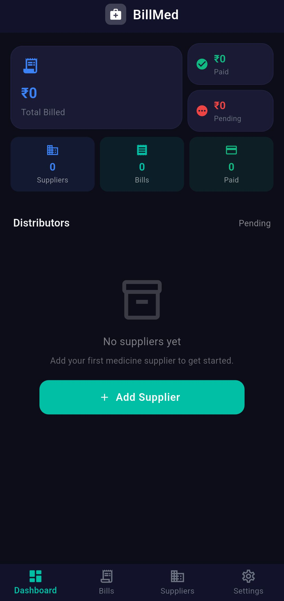
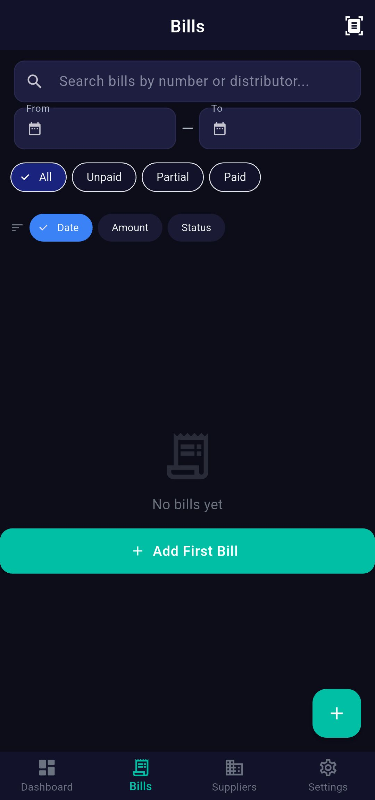
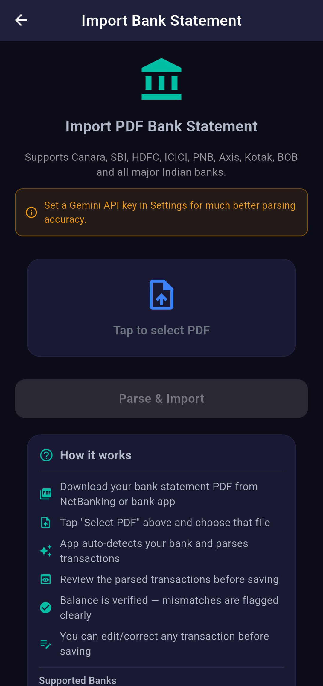
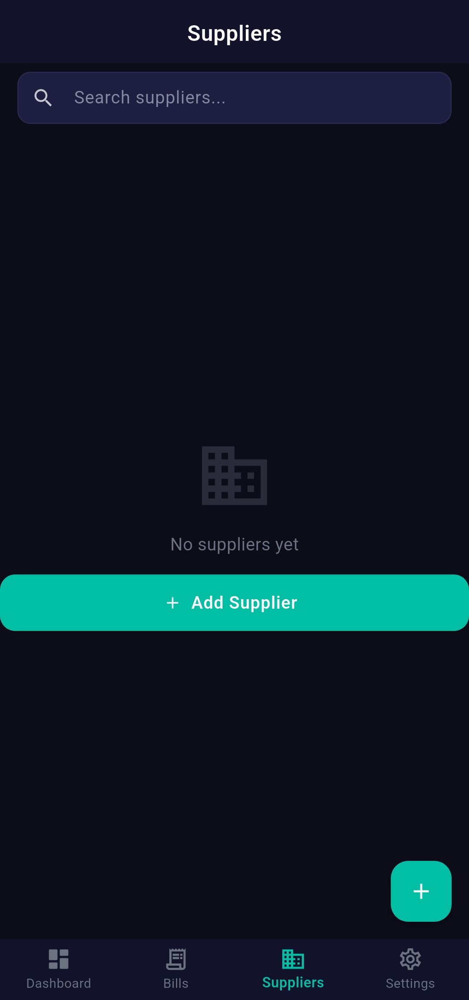
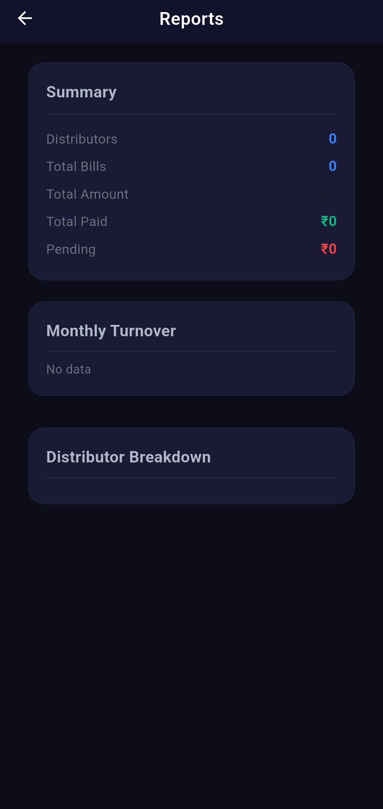
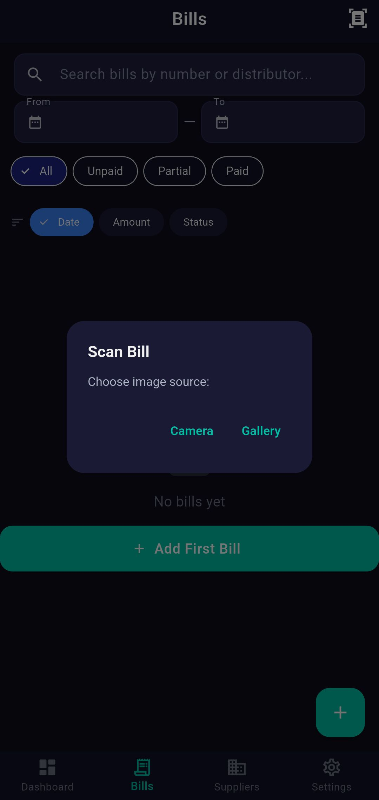
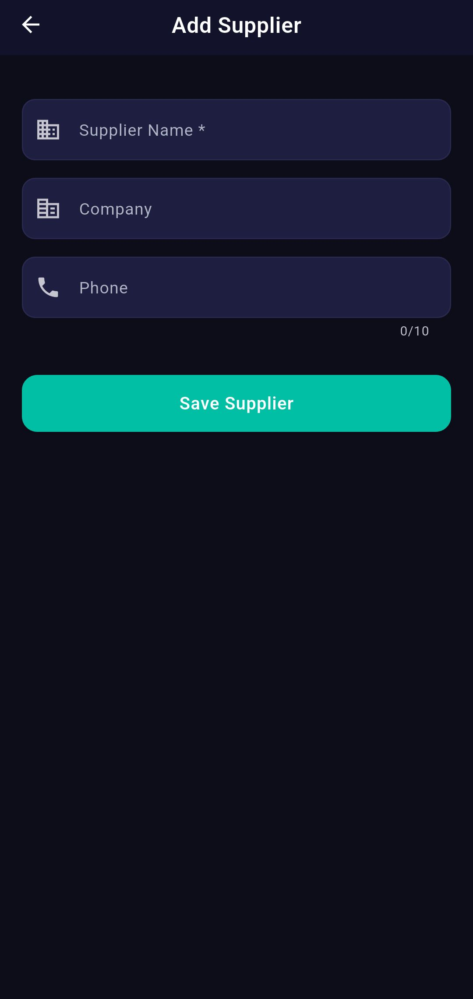
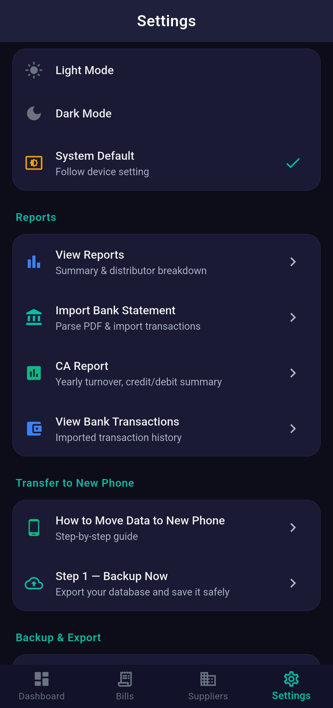
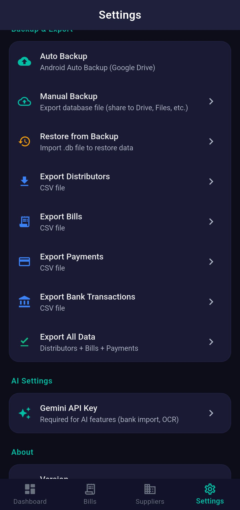

# BillMed

**An offline-first Flutter app for medical shop billing, supplier payments, and CA-ready financial reporting in India.**

[](https://www.gnu.org/licenses/agpl-3.0)
[](https://flutter.dev)
[](https://dart.dev)
[-green.svg)](#)
[](#)

---

## 📋 Overview

BillMed streamlines supplier payment management and financial reporting for medical shop owners in India. With intelligent bank statement parsing, real-time ledger tracking, and professional CA-ready reports—all working completely offline.

### ✨ Key Highlights

- **99.96% Bank Statement Parsing** (tested on 5,215+ transactions)
- **13+ Indian Banks Supported** (Auto-detection: SBI, HDFC, ICICI, Canara, Axis, etc.)
- **Automatic Reversal Detection** (Returns, cheque bounces, refunds)
- **Zero Internet Required** for core features
- **Professional CA-Ready Reports** (7 configurable sections with charts)
- **Real-Time Dashboard** (Auto-refresh every 8 seconds)

---

## 📸 Screenshots

<div align="center">
  
  
  
  
  
  
  
  
  
</div>

---

## 🚀 Core Features

### 💰 Supplier Payment Management
- Track bills from multiple distributors
- Record 5 payment modes: Cash, UPI, Cheque, NEFT, RTGS
- Auto-calculate bill status: Unpaid → Partial → Paid
- Real-time balance tracking per supplier
- Overdue bill notifications

### 🏦 Intelligent Bank Statement Parsing
- **Dual-format parsing**: Single-line (SBI/HDFC) and multi-line (Canara/PNB)
- **Auto bank detection** from PDF header
- **30+ keyword classification** for accurate debit/credit detection
- **Reversal detection** (auto-tags returns, cheque bounces, refunds)
- **Batch import**: 5,000+ transactions in one session
- **Optional AI enhancement**: Google Gemini API with local fallback
- **Manual entry option** if needed

### 📊 Financial Reporting
- **CA-Ready PDF Reports** (7 configurable sections):
  - Purchase & Payables Summary
  - Bank Cash Flow Statement
  - GST Input Tax Estimate
  - Monthly Bank Breakdown (charts)
  - Supplier-wise Purchase Table
  - Reversal/Return Summary
  - Full Transaction Ledger
- **Customizable fields**: Business name, proprietor, GSTIN
- **Multi-format export**: PDF + CSV

### 📱 Offline-First Architecture
- **SQLite local database**: All data on device
- **Auto-backup on pause**
- **Manual backup/restore** via Google Drive, WhatsApp, Email
- **CSV export** for all data types

### 🔐 Additional Features
- **OCR Bill Scanning** (Google ML Kit)
- **Dark Mode** (system-aware)
- **Notifications** for overdue bills
- **Auto-Update Check** from GitHub

---

## 📦 Quick Start

### Prerequisites
- Flutter 3.41+
- Dart 3.11+
- Android SDK (API 23+)

### Installation

```bash
# Clone the repository
git clone https://github.com/krsnaSuraj/BillMed.git
cd BillMed

# Install dependencies
flutter pub get

# Generate code (Drift ORM & Riverpod)
dart run build_runner build --delete-conflicting-outputs

# Run the app
flutter run

# Build release APK
flutter build apk --release --obfuscate --split-debug-info=debug-info
```

### Windows Build Automation
Run `UPDATE.bat` for automated versioning and building with 4 options.

---

## 🏗️ Architecture

### Tech Stack
- **Flutter 3.41** - UI Framework
- **Riverpod 2.6+** - State Management
- **Drift (SQLite ORM) 2.21+** - Database
- **Google Gemini API** - Optional PDF parsing
- **Google ML Kit** - OCR
- **fl_chart** - Data visualization

### Database Schema (4 Tables)
- **distributors**: Supplier information
- **bills**: Purchase invoices
- **payments**: Payment records (5 modes)
- **bank_transactions**: Bank statements (with reversal detection)

---

## 📊 Bank Statement Parsing

### Supported Banks
Canara, SBI, HDFC, ICICI, Axis, PNB, Kotak, BOB, Union, Yes Bank, IndusInd, Federal, IDFC, and others.

### Parsing Strategy
1. Auto-detect bank from PDF header
2. Dual-format support (single-line & multi-line)
3. 30+ keywords for classification
4. Automatic reversal detection
5. Balance verification & duplicate detection
6. Gemini API fallback for complex statements

### Performance
- **Accuracy**: 99.96% on 5,215+ real transactions
- **Speed**: ~0.5 sec per PDF (local parsing)
- **Reversal Detection**: 98%+ precision

---

## 🔧 Configuration

### Gemini API (Optional)
1. Go to **Settings** → **Gemini API Key**
2. Create key at [makersuite.google.com/app/apikey](https://makersuite.google.com/app/apikey)
3. App uses Gemini first, falls back to local parser
4. Key stored locally only

> **Note**: Works perfectly without API key (99.96% accuracy with built-in parser)

### Backup & Export
- **Manual**: Settings → Backup & Export → Export Backup
- **Auto**: Silent backup on app pause
- **Restore**: Import `.db` file anytime
- **CSV Export**: All data types (open in Excel)

---

## 🤝 Contributing

### How to Contribute
1. Fork the repo: `git clone https://github.com/krsnaSuraj/BillMed.git`
2. Create feature branch: `git checkout -b feature/your-feature`
3. Make changes & test: `flutter test && flutter run --release`
4. Commit: `git commit -m "feat: your message"`
5. Push & open PR

### Contribution Guidelines
- Follow [Dart Style Guide](https://dart.dev/guides/language/effective-dart/style)
- Run `dart format lib/` and `flutter analyze`
- For bank support: Add pattern to `bank_statement_service.dart`, test with 50+ real transactions
- Update documentation

---

## 📜 Licensing

**BillMed** is licensed under **AGPL-3.0**.

- ✅ Free to use, modify, and distribute
- ⚠️ Modifications must be shared back with the community
- ⚠️ Copyleft requirement: Derivative works must be open source

**Contact maintainer for proprietary licensing alternatives.**

See [LICENSE](./LICENSE) for details.

---

## ❓ FAQ

**Q: Is internet required?**  
A: No. Core features work fully offline. Internet only for optional Gemini API & update checks.

**Q: How secure is my data?**  
A: All data stored locally on your device. Nothing sent to external servers unless you enable Gemini API.

**Q: Can I use this commercially?**  
A: Yes, under AGPL-3.0 terms. Modifications must be shared back.

**Q: What if bank parsing fails?**  
A: Use manual entry or enable Gemini API for AI assistance.

**Q: Can I export my data?**  
A: Yes. CSV export for all data types or full database backup.

---

## 📞 Support

- **Issues**: [GitHub Issues](https://github.com/krsnaSuraj/BillMed/issues)
- **Discussions**: [GitHub Discussions](https://github.com/krsnaSuraj/BillMed/discussions)
- **Bug Reports**: Include reproducible steps, Flutter version, device info

---

## 📝 Version History

**v2.7.1** (Current)
- Bank statement parsing (99.96% accuracy)
- CA-ready report generation
- Auto-backup on pause
- Overdue bill notifications

**v2.7.0**
- Initial production release
- Offline-first architecture
- Riverpod state management

---

**Built with ❤️ for Indian medical shop owners.**

*For issues, feedback, or contributions, visit [GitHub](https://github.com/krsnaSuraj/BillMed).*
