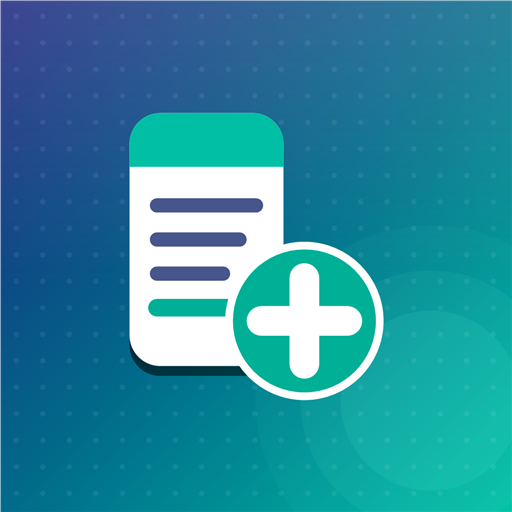
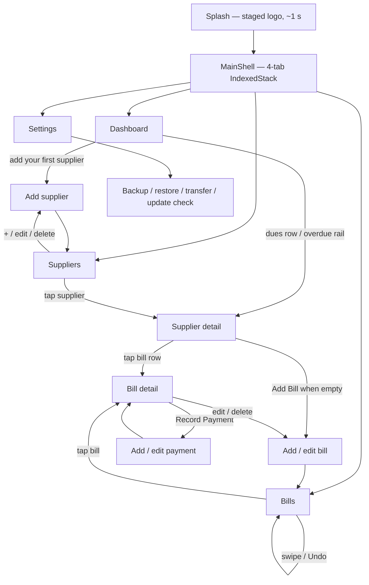
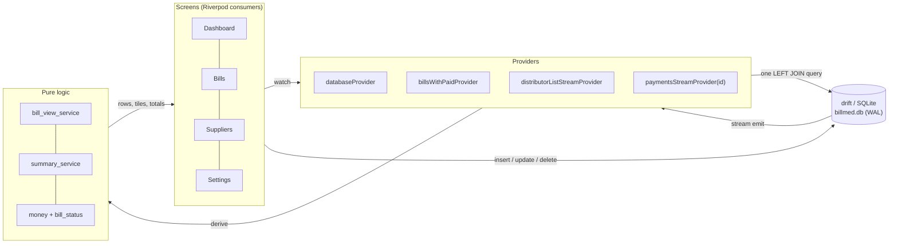
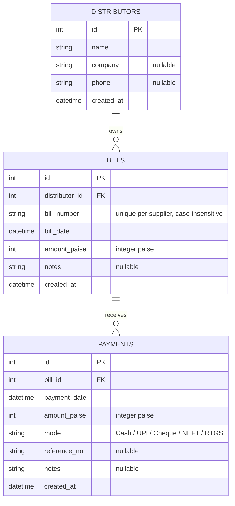
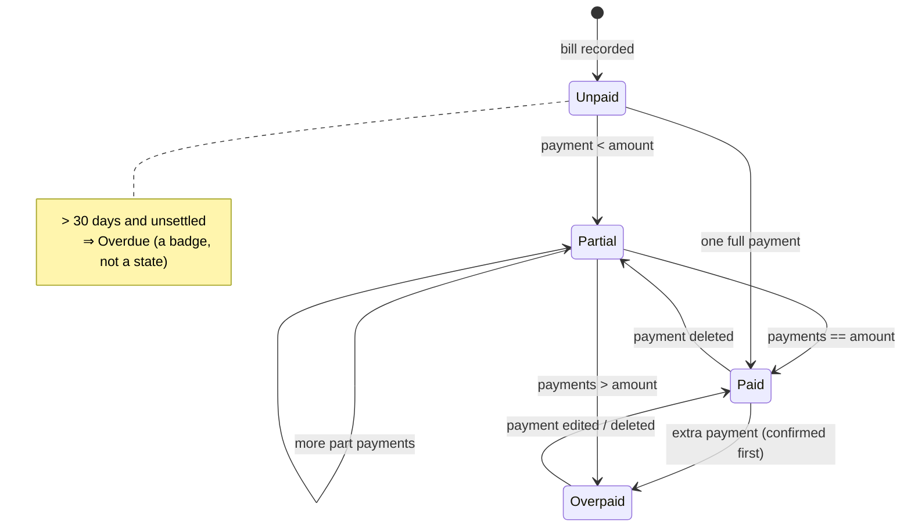
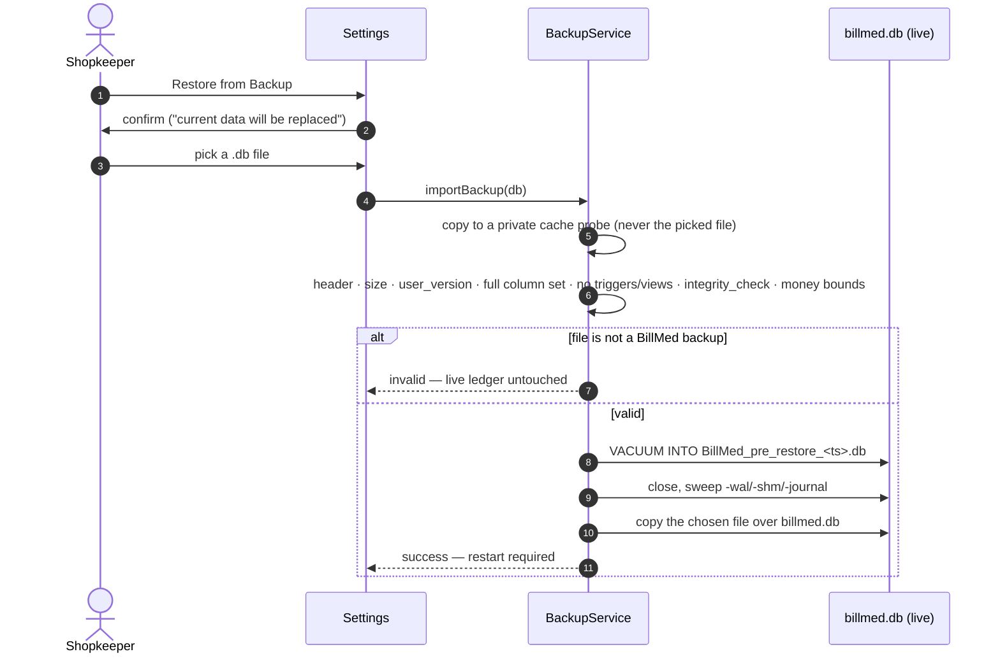

<div align="center">



# BillMed

**Supplier khata & payments for a medical retail shop — offline, no account, no server.**

Track every supplier bill, record part or full payments, and always know exactly
who you owe and how much. Everything lives on the phone: one SQLite file, no
sync, no login, no telemetry.

[](CHANGELOG.md)
[](pubspec.yaml)
[](#installation)
[](https://flutter.dev)
[](https://dart.dev)
[](#testing)
[-003B57?style=flat-square)](#architecture)
[](LICENSE)

</div>

---

## Table of contents

- [Why](#why)
- [Features](#features)
- [Screens](#screens)
- [How it works](#how-it-works)
- [Money model](#money-model)
- [Bill lifecycle](#bill-lifecycle)
- [Data safety](#data-safety)
- [Privacy & permissions](#privacy--permissions)
- [Installation](#installation)
- [Development](#development)
- [Release](#release)
- [Testing](#testing)
- [Project structure](#project-structure)
- [Design system](#design-system)
- [Troubleshooting](#troubleshooting)
- [FAQ](#faq)
- [Changelog](#changelog)
- [License](#license)

---

## Why

A medical retail shop runs on supplier credit: goods arrive today, the bill is
paid in parts over weeks, and the paper khata gets messy. BillMed replaces that
khata with something that answers four questions instantly:

| Question | Where the answer lives |
|---|---|
| How much do I owe in total right now? | Dashboard headline — the sum of the dues rows under it |
| Which supplier do I owe, and how much? | Suppliers ledger, sorted by dues |
| Which bills make up that number? | Supplier page: every bill with its own Billed / Paid / Due |
| Is anything overdue? | Overdue chips, the dashboard alert rail, and per-bill `· Overdue` |

It is built for one user on one phone, and it is built to survive: integer-paise
money, one watched SQLite query as the single source of truth, and a backup /
restore path that refuses to touch the ledger unless a file is provably one of
its own.

---

## Features

| Area | What you get |
|---|---|
| **Dashboard** | Pending total equal to the sum of the dues rows, last-6-months purchase hero with an animated sparkline, overdue alert rail (deep-links into Bills), total-paid ledger row, per-supplier dues ledger |
| **Bills** | Search by bill number or supplier, 5 status chips with live counts, supplier filter, 3 sort orders, month groups, full Reset, swipe-to-delete with transactional Undo |
| **Bill detail** | Collapsing status-tinted header, Paid / Due summary, Advance line on overpaid bills, payment timeline with edit / delete + Undo, Record Payment FAB while unsettled |
| **Payments** | Cash, UPI, Cheque, NEFT, RTGS + reference & notes; Pay Full shortcut whose tick appears only when the field really holds the full balance; overpay always asks first; a payment can never be dated before its bill |
| **Suppliers** | Dues ledger with name / company / phone search, live-balance detail page, tap-to-call, and the full bill list where every bill shows `Billed` / `Paid` / `Due` (or `Advance`) |
| **Supplier bill scopes** | All / Pending / Paid / Overdue with live counts; the Billed, Paid and Pending tiles *are* the filters for the bills behind those numbers |
| **Long names** | Supplier names wrap up to two lines and then scroll their own line — a trade name is never cut off with an ellipsis |
| **Backup & restore** | One-tap export, silent auto snapshot on app pause, My Backups tile (manual / before-restore / auto) with re-share, restore validated against a strict schema gate with a safety copy first |
| **Theme** | Light / Dark / System segmented control, persisted |
| **Update check** | Manual check against GitHub releases from Settings, hardened against hostile tag text |

Deliberately **not** included: cloud sync, multi-user access, invoice scanning,
GST filing, recurring entries, and a supplier PDF statement export (removed in
0.1.1 — the ledger page answers the same question faster).

---

## Screens

Four tabs, one shell. Tapping a row always goes one level deeper, never sideways.


```mermaid
flowchart TD
    Splash["Splash — staged logo, ~1 s"] --> Shell["MainShell — 4-tab IndexedStack"]
    Shell --> Dash["Dashboard"]
    Shell --> Bills["Bills"]
    Shell --> Sup["Suppliers"]
    Shell --> Set["Settings"]

    Dash -->|"dues row / overdue rail"| SD["Supplier detail"]
    Dash -->|"add your first supplier"| AddSup["Add supplier"]
    Bills -->|"tap bill"| BD["Bill detail"]
    Bills -->|"swipe / Undo"| Bills
    Sup -->|"tap supplier"| SD
    Sup -->|"+ / edit / delete"| AddSup
    SD -->|"tap bill row"| BD
    SD -->|"Add Bill when empty"| AddBill["Add / edit bill"]
    BD -->|"Record Payment"| AddPay["Add / edit payment"]
    BD -->|"edit / delete"| AddBill
    AddSup --> Sup
    AddBill --> Bills
    AddPay --> BD
    Set --> Backup["Backup / restore / transfer / update check"]
```

### Supplier page — the bill ledger

The page that answers "which bills are his, and what does each one owe":

```text
┌───────────────────────────────────────────────┐
│  ←  Shree Ganesh Medical Agency (Wholesale)   │   collapsing header
│     Sample Pharma · 98765 43210 · tap to call │
│     Pending  ₹21,552                          │
├───────────────────────────────────────────────┤
│  ┌ Billed ┐  ┌  Paid  ┐  ┌ Pending ┐          │   tiles ARE the filters
│  │ ₹35,752│  │ ₹14,200│  │ ₹21,552 │          │   (active tile stays lit)
│  └────────┘  └────────┘  └─────────┘          │
│  ( All (5) ) ( Pending (3) ) ( Paid (3) ) …   │   chips + live counts
├───────────────────────────────────────────────┤
│  Bills                                   3 of 5│
│  #INV-004                            Overpaid  │
│  05/09/2026 · Billed ₹300                      │
│  Paid ₹400 · Advance ₹100                      │
│  ─────────────────────────────────────────────│
│  #INV-005                             Unpaid   │
│  01/08/2026 · Billed ₹700                      │
│  Paid ₹0 · Due ₹700 · Overdue                  │
└───────────────────────────────────────────────┘
```

Every number above is traceable: `Billed` is the sum of the `Billed` lines, the
`Paid` tile is the sum of the `Paid` lines of the bills in the `Paid` scope, and
`Pending` is the per-supplier net of what is still owed.

---

## How it works


```mermaid
flowchart LR
    subgraph UI["Screens (Riverpod consumers)"]
        direction TB
        S1["Dashboard"] --- S2["Bills"] --- S3["Suppliers"] --- S4["Settings"]
    end
    subgraph P["Providers"]
        direction TB
        P1["databaseProvider"]
        P2["billsWithPaidProvider"]
        P3["distributorListStreamProvider"]
        P4["paymentsStreamProvider(id)"]
    end
    subgraph L["Pure logic"]
        direction TB
        V["bill_view_service"] --- M["summary_service"] --- N["money + bill_status"]
    end
    DB[("drift / SQLite\nbillmed.db (WAL)")]

    UI -->|"watch"| P
    P -->|"one LEFT JOIN query"| DB
    DB -->|"stream emit"| P
    P -->|"derive"| L
    L -->|"rows, tiles, totals"| UI
    UI -->|"insert / update / delete"| DB
```

One query — `watchAllBillsWithPaid()` — is the source of truth for the whole
app. It is a `LEFT JOIN` of `bills` against a `GROUP BY bill_id` payment sum, so
a bill with no payments still appears. Status, remaining, overdue and every
balance are **derived on each read**; nothing is cached, so nothing can go
stale. Writes go UI → database method → drift re-emits → every watcher rebuilds.


```mermaid
erDiagram
    DISTRIBUTORS ||--o{ BILLS : "owns"
    BILLS ||--o{ PAYMENTS : "receives"

    DISTRIBUTORS {
        int id PK
        string name
        string company "nullable"
        string phone "nullable"
        datetime created_at
    }
    BILLS {
        int id PK
        int distributor_id FK
        string bill_number "unique per supplier, case-insensitive"
        datetime bill_date
        int amount_paise "integer paise"
        string notes "nullable"
        datetime created_at
    }
    PAYMENTS {
        int id PK
        int bill_id FK
        datetime payment_date
        int amount_paise "integer paise"
        string mode "Cash / UPI / Cheque / NEFT / RTGS"
        string reference_no "nullable"
        string notes "nullable"
        datetime created_at
    }
```

Deeper material — provider graph, migrations, screen contracts, failure modes,
test strategy — is in [`ARCHITECTURE.md`](ARCHITECTURE.md).

---

## Money model

All money is stored and computed as **integer paise**. `double` appears only
inside the input parser and the display formatter, never in storage or
arithmetic.

```text
typed input          parsed value                stored        shown as
"1,250"        →    1250.00 rupees          →   125000 paise  →  ₹1,250
"1,000.25"     →    1000.25 rupees          →   100025 paise  →  ₹1,000.25
"12,50"        →    rejected (not grouping) →   nothing saved →  "Enter a valid amount"
```

Commas are honoured **only as digit grouping** (Indian `12,34,567` and Western
`1,234,567`). A comma that is not a valid grouping — `12,50`, `1,2,3`, `1,,000`
— makes the input invalid instead of being stripped, because stripping used to
turn a typed ₹12.50 into ₹1,250. Amounts are capped at 11 digits, per-row values
beyond ₹100 crore and negative values are rejected by both the forms and the
restore gate.

Bill status is derived, never stored:

```text
amount <= 0            → Paid      (legacy/imported zero-amount rows settle)
paid   <= 0            → Unpaid
paid   <  amount       → Partial
paid   == amount       → Paid
paid   >  amount       → Overpaid
```

`remainingPaise` is clamped at zero, so an overpaid bill shows `₹0` due while
keeping its Overpaid status, and the surplus is shown as an **Advance with
supplier** line (`paid − amount`).

**Per-supplier netting.** A supplier balance nets across that supplier's bills
before clamping at zero: an overpayment on one bill offsets dues on another bill
of the *same* supplier, never another supplier's. The dashboard headline is the
sum of those per-supplier dues, so the number at the top always equals the rows
underneath it. A supplier whose dues are only *netted* away is never shown as
`Clear` — if a bill is still unsettled, the row keeps its warning rail.

**Overdue** means unsettled and more than 30 days old at day granularity
(exactly 30 days is not overdue; a settled old bill never is).

---

## Bill lifecycle


```mermaid
stateDiagram-v2
    [*] --> Unpaid: bill recorded
    Unpaid --> Partial: payment < amount
    Partial --> Partial: more part payments
    Partial --> Paid: payments == amount
    Unpaid --> Paid: one full payment
    Paid --> Overpaid: extra payment (confirmed first)
    Partial --> Overpaid: payments > amount
    Overpaid --> Paid: payment edited / deleted
    Paid --> Partial: payment deleted
    note right of Unpaid
        > 30 days and unsettled
        ⇒ Overdue (a badge, not a state)
    end note
```

Payments are append-only history: editing or deleting one re-derives the bill's
status on the next stream emission, and both actions offer **Undo** that
re-inserts the exact row (amount, mode, reference, notes and date) in one
transaction.

---

## Data safety

Backups are **plaintext SQLite files** — never encrypted, never password
protected. Anyone holding the file can read the full ledger. The app says so on
the Backup Now tile, in the share text, and in the transfer guide.


```mermaid
sequenceDiagram
    autonumber
    actor U as Shopkeeper
    participant S as Settings
    participant B as BackupService
    participant D as billmed.db (live)

    U->>S: Restore from Backup
    S->>U: confirm ("current data will be replaced")
    U->>S: pick a .db file
    S->>B: importBackup(db)
    B->>B: copy to a private cache probe (never the picked file)
    B->>B: header · size · user_version · full column set · no triggers/views · integrity_check · money bounds
    alt file is not a BillMed backup
        B-->>S: invalid — live ledger untouched
    else valid
        B->>D: VACUUM INTO BillMed_pre_restore_<ts>.db
        B->>D: close, sweep -wal/-shm/-journal
        B->>D: copy the chosen file over billmed.db
        B-->>S: success — restart required
    end
```

Guarantees enforced in code and covered by tests:

- a file is only published as a backup after it **opens, validates, and holds
  exactly the same row counts** as the live ledger;
- a copy-based snapshot requires a successful WAL checkpoint — an unflushed copy
  that would silently miss the newest entries fails instead;
- restore validates the **complete column set** for the file's declared schema
  version, so a crafted "legacy" file can no longer pass and then brick the next
  launch inside the migration;
- triggers and views are refused (they could ride into the live database);
- a pre-restore safety copy is written first, and `No safety copy ⇒ no restore`;
- the ledger is excluded from Android cloud backup and device transfer, so the
  only copies that exist are ones the user made on purpose.

Local copies may accumulate in app-private storage; the My Backups tile always
shows the newest one (manual → before-restore → auto) and can re-share it. Keep
backups where only you control access, and treat the plaintext file like cash.

---

## Privacy & permissions

| Permission | Why |
|---|---|
| `android.permission.INTERNET` | Only for the manual GitHub release check in Settings. Nothing else touches the network. |

No storage, contacts, camera or location permissions. No analytics, no crash
reporting, no ads, no account. Restore uses the system file picker; sharing uses
the system share sheet. `android:allowBackup="false"` plus `dataExtractionRules`
and `fullBackupContent` allowlists (prefs only) keep the ledger out of Android
cloud backup and device-to-device transfer. `android:usesCleartextTraffic="false"`.

The full threat model, the restore-validation gate and the release-signing keystore rule are documented in `ARCHITECTURE.md`.

---

## Installation

### For the shop phone

1. Take the newest APK from [Releases](https://github.com/krsnaSuraj/BillMed/releases)
   (or build it yourself, below).
2. Open it on the phone and allow "install unknown apps" for the file manager.
3. Upgrades install **in place**: same application id and same signing key, so
   the ledger is preserved. Never uninstall to update.
4. Open Settings → **My Backups** and keep one copy somewhere you control.

### Requirements

Android 7.0+ (`minSdk 24`), `targetSdk 35`, arm64 / arm32 / x86_64.

---

## Development

Prerequisites: Flutter 3.44+ (Dart ^3.3.0), Android SDK 35, JDK 17+.

```bash
flutter pub get
flutter run                 # debug on a connected device
flutter test                # full offline suite
flutter analyze             # must be clean (CI runs --fatal-infos)
dart format --output=none --set-exit-if-changed lib   # CI formatting gate
```

Useful single-file runs:

```bash
flutter test test/supplier_detail_test.dart
flutter test test/backup_probe_test.dart
flutter test --plain-name "Pay Full"
```

---

## Release

Release signing reads `android/key.properties` (gitignored — never commit it):

```properties
storeFile=../keystore/billmed-release.jks
storePassword=…
keyAlias=…
keyPassword=…
```

Build the **production** APK (release, signed, obfuscated, with debug symbols
split out for symbolicating crash reports):

```bash
flutter build apk --release --obfuscate --split-debug-info=debug-info
# → build/app/outputs/flutter-apk/app-release.apk
```

Bump `version:` in `pubspec.yaml` first (`0.1.1+7` = version name + Android
version code). Android only accepts an in-place update with the **same signing
key** and a **non-decreasing version code** — that is why a debug APK cannot
replace an installed release build, and why the version code keeps counting up.

Publish: push the commit, tag it `v0.1.1+7`, attach the APK to the GitHub
release. The in-app update check compares that tag with the installed version.

---

## Testing

`flutter test` — 214 tests, all offline (in-memory database, pure functions,
widget flows, hand-built backup files). No device, no network, no mocks of the
data layer: the tests drive the real drift database.

| File | Tests | Focus |
|---|---|---|
| `add_distributor_test.dart` | 6 | supplier form: required name, phone rules, trimming, edit prefill |
| `backup_probe_test.dart` | 13 | restore gate: valid file, missing columns, legacy brick case, wrong types, NULL/fractional money, triggers, truncation |
| `backup_validation_test.dart` | 14 | money fuzz, formatting round-trips, summary edge cases |
| `bill_filters_test.dart` | 2 | Bills tab search / chips / supplier pill / sort / reset |
| `bill_ops_test.dart` | 7 | bill edit guards, payment Undo restores the exact row, live stream invalidation |
| `bill_status_test.dart` | 12 | status + overdue boundaries, labels, zero-amount bills |
| `bill_view_service_test.dart` | 18 | supplier scopes, counts, tile arithmetic, sorting |
| `dashboard_money_test.dart` | 5 | headline == rows, overdue rail money, netted-away dues |
| `database_test.dart` | 15 | aggregates, cascades, uniqueness, live queries |
| `edge_cases_test.dart` | 20 | adversarial money, boundary rules, summary edges, overdue rail |
| `long_name_test.dart` | 18 | name wrapping / scrolling at real phone width, shipped-font metrics |
| `migration_test.dart` | 4 | v1 / v2 / v3 files migrate to v4 with exact paise |
| `money_test.dart` | 12 | parsing, grouping rules, formatting, round-trips |
| `motion_widgets_test.dart` | 5 | motion widgets pump without crashing |
| `pay_full_chip_test.dart` | 10 | Pay Full chip state machine |
| `payment_guards_test.dart` | 7 | payment date / overpay / mode round-trip / validation |
| `sheets_test.dart` | 5 | action sheet + confirm sheet contracts |
| `summary_service_test.dart` | 7 | per-supplier netting, sums, sorting, overdue |
| `supplier_detail_test.dart` | 12 | bill ledger, scopes, tiles-as-filters, empty states |
| `update_service_test.dart` | 17 | version-tag validation against hostile input |
| `widget_flows_test.dart` | 4 | dashboard, bills and the add-payment flow end to end |
| `widget_test.dart` | 1 | splash renders |

Harness rules (all discovered the hard way, documented in
`test/widget_harness.dart`):

- **No `pumpAndSettle()`** — loading states run an infinite shimmer, so the tree
  never settles. Tests pump a bounded number of frames until a condition holds.
- **A real phone surface** — `phoneSurface()` uses the reporting device's exact
  logical size (393 × 873 dp), because row layouts that fit a tablet width break
  there.
- **Text is measured with the shipped font** — widget tests render every glyph
  as a 1-em box, so "does this name fit" is measured through a `TextPainter` with
  the bundled Roboto instead of trusting the on-screen box.
- **Explicit unmount** — `disposeTree()` flushes drift's stream-cancel timer
  inside the test body.

Not covered by automation, by design: the platform file picker, the share sheet
and the Android path channels (they need a device). Everything behind them —
including the whole restore-validation gate — is covered.

---

## Project structure

```text
BillMed/
├── lib/
│   ├── main.dart                      # prefs → theme override → SplashScreen
│   ├── database/                      # drift tables, schema v4, cascades, migrations
│   ├── models/                        # bill status + payment modes
│   ├── providers/                     # database + theme providers (Riverpod)
│   ├── services/
│   │   ├── backup_service.dart        # export · auto snapshot · validated restore
│   │   ├── bill_view_service.dart     # supplier bill scopes, counts, sort (pure)
│   │   ├── summary_service.dart       # per-supplier netting, totals (pure)
│   │   └── update_service.dart        # GitHub release check (hardened)
│   ├── screens/
│   │   ├── splash_screen.dart         # staged logo + 4-tab shell + deep link
│   │   ├── dashboard/                 # hero, sparkline, overdue rail, dues ledger
│   │   ├── bills/                     # list (filter/sort/undo) · detail · add/edit
│   │   ├── payments/                  # add/edit with the overpay + date guards
│   │   ├── distributors/              # supplier list · bill ledger · add/edit
│   │   └── settings/                  # theme, backup/restore, update check
│   ├── theme/app_theme.dart           # colours, gradients, radius, motion, haptics
│   ├── utils/                         # integer-paise money, text helpers
│   └── widgets/                       # mesh, glass, sparkline, sheets, chips,
│                                      # animated money, wrap-or-scroll text
├── test/                              # 22 files + shared harness
├── android/                           # manifest, backup rules, adaptive icons, signing
├── assets/                            # icon source + reference fonts
├── README.md · ARCHITECTURE.md · CHANGELOG.md
└── .github/workflows/build.yml        # format · analyze · test on every push
```

---

## Design system

- **Palette** — indigo `#1A237E` → teal `#00BFA5` brand gradient, with soft
  success / warning / danger gradients; light `#F0F2F8` and dark `#0D0D1A`
  backgrounds, brightness-aware text helpers.
- **Shape** — radius scale 12 / 16 / 20 / 28 / pill; frosted `GlassBar` under
  collapsing headers; aurora `MeshHeader` blobs behind every screen.
- **Motion** — 150 / 250 / 300 ms tokens, a 60 ms stagger for list entrances,
  fade + slide page transitions, scroll-linked tilt on the dashboard hero, and
  `AnimatedMoney` counting between values.
- **Feedback** — one haptic vocabulary (select / confirm / destroy), floating
  snackbars with Undo, and honest empty states that name the filter that is
  hiding the data.

---

## Troubleshooting

| Symptom | What to do |
|---|---|
| A supplier page is empty | Check the scope chips: `Pending (0)` or a stale filter is the usual cause — tap `Show all bills` |
| Dashboard says ₹0 but a supplier row shows dues | Fixed in 0.1.1: the headline is now the sum of the rows. Update the app. |
| Backup fails | The snapshot is verified before it is published; a failure is honest. Free up space and retry. |
| Restore says the file is invalid | The app only accepts files BillMed itself created. Restore validates the schema version, columns, integrity and money bounds. |
| Missed a payment | Bill detail → the payment's ⋮ menu → Edit, or delete it and use Undo |
| Phone shows an old version | Uninstall is never needed; install the newer APK over it (same signing key) |

---

## FAQ

**Is my data in the cloud?** No. One SQLite file in the app's private storage.

**Can my accountant get the numbers?** Settings → Backup Now, then share the
file. Remember it is plaintext.

**What happens if I lose the phone?** Whatever backup you shared is what
survives. There is no server copy.

**Why is there no PDF statement?** It was removed in 0.1.1: the supplier page now
shows every bill with its own Billed / Paid / Due, which is faster than reading a
PDF on a phone.

**Why can't I enter a future bill date?** The picker stops at today, so the
overdue rule always means something.

---

## Changelog

See [`CHANGELOG.md`](CHANGELOG.md) — `0.1.1` fixed the supplier bill list that
never rendered, made the Pay Full chip honest, hardened restore validation,
corrected the money parser and the dashboard total, and removed the statement
export.

---

## License

MIT © 2026 krsnaSuraj — see [`LICENSE`](LICENSE).
