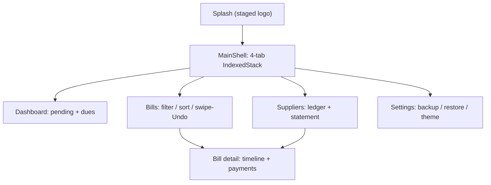
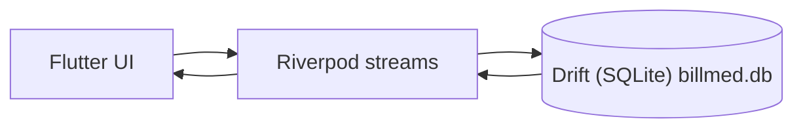

<div align="center">
  
  <h1>BillMed</h1>
  <p><b>Supplier Khata & Payments</b> — offline supplier-bill ledger for a medical retail shop.</p>
  <p>Replaces the paper khata: add suppliers, record their bills, record part or full payments, and always know exactly who you owe and how much. All data stays on your phone — no account, no server, no sync.</p>


</div>

---

## Table of contents

- [Features](#features)
- [How it works](#how-it-works)
- [Money model](#money-model)
- [Backup model](#backup-model)
- [Permissions & privacy](#permissions--privacy)
- [Getting started](#getting-started)
- [Testing](#testing)
- [Project structure](#project-structure)
- [Version](#version)
- [License](#license)

## Features

| Area | What you get |
|---|---|
| **Dashboard** | Pending total, last-6-months purchase hero with animated sparkline, overdue alert rail (deep-links into Bills), Total paid ledger row, per-supplier dues ledger |
| **Bills** | Search by bill number or supplier, 5 status chips with live counts, supplier filter, 3 sort orders, month groups, full Reset, swipe-to-delete with transactional Undo |
| **Bill detail** | Collapsing status-tinted header, Paid / Due summary, Advance line on overpaid bills, Settled pill, payment timeline with edit / delete + Undo |
| **Payments** | Cash, UPI, Cheque, NEFT, RTGS + reference & notes; Pay Full shortcut; overpay **always asks first** (create and edit); payment date can never precede the bill date |
| **Suppliers** | Dues ledger with name / company / phone search, live-balance detail page, tap-to-call, shareable PDF statement |
| **Backup & restore** | One-tap export, silent auto snapshot on app pause, My Backups tile with re-share, validated restore with safety copy |
| **Theme** | Light / Dark / System segmented control, persisted |
| **Update check** | Manual check against GitHub releases from Settings |


```mermaid
flowchart TD
    Splash["Splash (staged logo)"] --> Shell["MainShell: 4-tab IndexedStack"]
    Shell --> D["Dashboard: pending + dues"]
    Shell --> B["Bills: filter / sort / swipe-Undo"]
    Shell --> S["Suppliers: ledger + statement"]
    Shell --> ST["Settings: backup / restore / theme"]
    B --> BD["Bill detail: timeline + payments"]
    S --> BD
```

## How it works


```mermaid
flowchart LR
    UI["Flutter UI"] --> P["Riverpod streams"]
    P --> DB[("Drift (SQLite) billmed.db")]
    DB --> P
    P --> UI
```

One watched bills query (`watchAllBillsWithPaid`: bills `LEFT JOIN` payment sums) is the source of truth for Dashboard, Bills, Suppliers, and bill detail. Status, remaining, overdue, and balances are **derived on every read** — no cached total exists anywhere to go stale. Writes flow UI → database methods → streams re-emit → every watcher rebuilds.

Full design (providers graph, schema, migrations, state machines, contracts): [`ARCHITECTURE.md`](ARCHITECTURE.md).

## Money model

All money is stored and computed as **integer paise** (`amountPaise`). `double` appears only inside the input parser and the display formatter, never in storage or arithmetic. Input parses with `rupeesInputToPaise()`, display formats with `formatPaise()` using Indian grouping (`₹12,34,567`; paise shown only when non-zero).

Bill status is derived, never stored:

- `paid <= 0` → Unpaid
- `paid < amount` → Partial
- `paid == amount` → Paid
- `paid > amount` → Overpaid

`remainingPaise` is clamped at zero, so an overpaid bill shows `₹0` remaining while keeping its Overpaid status — and bill detail shows the surplus as an **Advance with supplier** line (`paid − amount`). Bill rows show a `Due ₹X` line while partial.

### Per-supplier netting

A supplier balance nets across that supplier's bills **before** clamping at zero: an overpayment on one bill offsets dues on other bills of the **same** supplier. It never offsets other suppliers, and pending never goes negative.

Numeric example:

- Bill A: ₹10,000 billed, ₹12,000 paid → −₹2,000
- Bill B: ₹5,000 billed, ₹0 paid → +₹5,000

`net = (10,000 − 12,000) + (5,000 − 0) = ₹3,000`, so the supplier shows **₹3,000 pending**. All-negative nets clamp to **₹0**. Dashboard totals apply the same rule globally. The dashboard overdue rail sums per-bill clamped dues of overdue bills, so it can read higher than the netted pending — both numbers are pinned by tests.

Overdue means unsettled and more than 30 days old at day granularity (31+ days — exactly 30 is not overdue).

## Backup model

Backups are **plaintext SQLite files — never encrypted, never password protected**. Anyone holding the file can read the full ledger. Plan accordingly.

- **Manual backup**: `VACUUM INTO` a temp file, sanity check (≥ 100 bytes), atomic rename to `BillMed_backup_<timestamp>.db`, then the OS share sheet. Cancelling the sheet is not a failure — the file stays in the app documents directory.
- **Auto-backup**: same snapshot technique into `BillMed_auto_backup.db`, fire-and-forget on app pause. Temp file + atomic rename, so a kill mid-write loses nothing. Silent and best-effort.
- **My Backups tile**: always shows the newest backup on the phone (manual preferred, auto as fallback) with one-tap re-share. Shared files are header-validated first, so a torn snapshot is never sent.
- **Restore**: system file picker (any file, probe rejects non-SQLite), then a probe of a private temp copy — magic header, 100 MB cap, `user_version` 1–4, required tables and amount columns, trigger/view rejection, `integrity_check`. Then a pre-restore safety copy (failure cancels with the live DB untouched), DB close, fail-closed sidecar sweep, copy over `billmed.db` — then restart. Concurrent backup/restore reports `busy` instead of failing silently.

Guidance: keep backups where only you control access (your own Drive, an email to yourself, a PC), delete copies you no longer need, take a backup weekly — the file is small. Only restore files BillMed itself produced.

## Permissions & privacy

From `android/app/src/main/AndroidManifest.xml`:

| Permission | Why |
|---|---|
| `android.permission.INTERNET` | Only for the manual GitHub release check. No other network use. |

No storage, contacts, camera, or location permissions. Restore uses the system file picker; sharing uses the system share sheet. `android:allowBackup="false"` plus backup/data-extraction rules exclude the ledger from Android cloud backup and device transfer (only lightweight prefs travel). `android:usesCleartextTraffic="false"`.

## Getting started

Prerequisites: Flutter 3.44+ (Dart ^3.3.0), Android SDK.

```bash
flutter pub get
flutter run            # debug on device
flutter test           # 95 offline tests
flutter analyze        # must be clean (fatal infos)
flutter build apk --release --obfuscate --split-debug-info=debug-info
```

Release signing reads `android/key.properties` (gitignored — never commit it):

```properties
storeFile=../keystore/billmed-release.jks
storePassword=…
keyAlias=…
keyPassword=…
```

CI (`/.github/workflows/build.yml`) only runs checks on every push to `main`: formatting, `flutter analyze --fatal-infos`, and `flutter test`. It never builds or signs anything — releases are built locally with the commands above and published manually from the release tag.

## Testing

`flutter test` — 95 tests, all offline (in-memory database, pure functions, widget flows):

| File | Tests |
|---|---|
| `backup_validation_test.dart` | 14 |
| `bill_filters_test.dart` | 2 |
| `bill_status_test.dart` | 10 |
| `database_test.dart` | 15 |
| `edge_cases_test.dart` | 20 |
| `migration_test.dart` | 4 |
| `money_test.dart` | 10 |
| `motion_widgets_test.dart` | 5 |
| `sheets_test.dart` | 5 |
| `summary_service_test.dart` | 5 |
| `widget_flows_test.dart` | 4 |
| `widget_test.dart` | 1 |

Harness: `NativeDatabase.memory()` + provider overrides, bounded pumps (skeleton shimmer never settles, so no `pumpAndSettle`), explicit unmount. Not unit-testable by design: file picker / share sheet / path channels (need a device — covered by on-device QA instead).

## Project structure

```
lib/
  main.dart                  # prefs -> theme override -> SplashScreen
  database/                  # Drift tables, v4 database, cascades, migration
  providers/                 # database + theme providers
  services/                  # backup, PDF statement, update check, summary
  models/                    # bill status, payment modes
  utils/                     # int-paise money, plural/initial helpers
  theme/                     # colors, gradients, radius, motion, haptics
  widgets/                   # mesh/glass/sparkline/tilt/sheets/chips/logo
  screens/
    splash_screen.dart       # staged logo + 4-tab shell + deep-link
    dashboard/               # hero, sparkline, overdue rail, dues ledger
    bills/                   # list (filter/sort/undo) + add + sliver detail
    payments/                # add/edit with overpay guard
    distributors/            # list + detail + add
    settings/                # theme, backup/restore/transfer, updates
test/                        # 12 files, 95 tests (table above)
android/                     # adaptive icon, backup rules, signing config
```

## Version

`0.1.0` (build `5`, see `pubspec.yaml`).

## License

MIT License, copyright 2026 krsnaSuraj — see [LICENSE](LICENSE).
